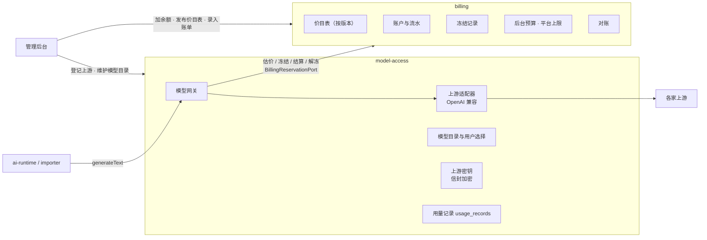
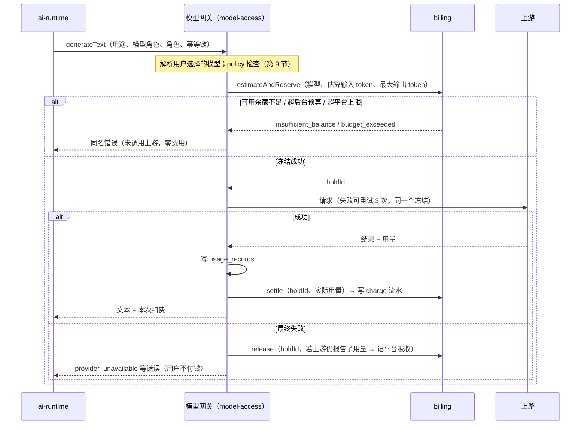

# 计费模块设计：平台中转、价目表、余额与流水

> 负责人：架构负责人 · v1.1 · 2026-10-05 · 来源任务：T-009；T-014 修订（6.3、6.4 余额恢复改为「加余额后重新检查」，第 7 节平台每日上限改为原子预留，计费端口拆分）
> 决策记录见 `docs/decisions/ADR-0012-relay-billing-and-wallet.md`（为什么这样选）；本文讲**具体怎么做**。
> 契约以 `packages/contracts/src/http/billing.ts`、`src/http/model-access.ts`、`src/ports/billing.ts`、`src/ports/model-gateway.ts` 为准。
> 价格数字、模型清单、默认后台预算数值不在本文定义：模型与价格见 `docs/ai/model-catalog.md`，费用估算与默认预算见 `docs/ai/cost-estimate.md`，产品参数见 PRD。

## 1. 结论（先看这段）

1. 平台在后台登记各家模型供应商的密钥（叫「**上游**」），用户在 App 里只选「模型」，不接触任何密钥。
2. 每次调用模型：**先冻结一笔估算的钱 → 调用 → 按实际用量结算，多退少补；调用失败就全额解冻，不扣钱。**
3. 用户钱包余额 = 所有流水加起来。流水只增不改，每一分钱都能查到来源。
4. 余额不够时，网关在调用供应商之前就拦下，不会产生费用；用户的消息照常送达，角色等加了余额后补一次回复。
5. 管理员在后台给用户加余额（首版不接真实支付），每天自动对账。

术语：
- **上游**：真正提供模型的服务，例如 DeepSeek 官方、阿里云百炼、OpenRouter 聚合服务。一个上游 = 一个接口地址 + 一把平台密钥。
- **模型目录**：用户能看到、能选的模型清单。每个模型对应「哪个上游的哪个模型名」。
- **冻结（预授权）**：先把一笔钱「圈起来」，不能被别的调用用掉，但还没真正扣走。
- **结算**：调用完成后按实际用量真正扣钱，并把多冻结的部分放回去。
- **流水**：一条「钱动了」的记录，例如「10 月 4 日 21:03 聊天扣 0.0123 元，余额 48.21 元」。
- **微元**：1 元 = 1,000,000 微元。系统内部一律用整数微元记钱，避免小数误差。

## 2. 模块分工



| 模块 | 拥有的数据（schema） | 不做什么 |
|---|---|---|
| `model-access` | `model_access`：`upstreams`（上游与加密密钥）、`model_catalog`（模型目录：模型键 → 上游 + 上游模型名、能力、标签、是否启用）、`leaderboard_entries`、`selections`、`character_overrides`、`usage_records`（每次调用的 token、耗时、状态、结算金额引用）、`upstream_status` | 不记钱、不判断余额 |
| `billing` | `billing`：`accounts`（账户：每用户一个钱包 + 一个平台账户；余额、提醒线、后台每日上限）、`ledger_entries`（流水，只增不改）、`holds`（冻结记录）、`price_versions` / `price_items`（价目表）、`daily_spend`（按用户当地日期的后台花费汇总）、`platform_daily_budget`（平台每日成本预算：已结算 + 预留中，第 7 节）、`upstream_bills`（管理员录入的上游账单）、`reconciliation_runs`（对账结果） | 不调用模型、不 import `model-access` |

依赖方向：`model-access` → `billing`（同层调用，单向）。`billing` 不调用 `model-access`；它需要的模型信息（模型键）由调用方传入。

## 3. 上游与平台密钥

### 3.1 规则

1. 只有管理员能在管理后台登记上游：名称、接入类型（v1 只有 `openai_compatible`，个别非兼容的语音 / 图片接口由 AI 负责人在适配器中单独处理）、接口地址、密钥。
2. 保存前先做连通测试（调用上游的模型列表或一次极小请求），记平台账户，用途 `admin_upstream_test`。
3. 加密：沿用 `security-and-privacy.md` 第 3 节的信封加密，数据密钥改为**平台数据密钥**（`platform.user_data_keys` 中一行特殊的平台记录，owner = `platform`），AAD = `upstream:{upstreamId}`。
4. 任何接口都只返回掩码（前 4 后 4 位）。解密只在网关发请求的那一刻发生。
5. 上游状态：`active` / `invalid`（密钥被作废）/ `quota_exhausted`（平台在该上游的余额用完）/ `unavailable`（重试后仍失败）。状态变化时：
   - 写 `model_access.upstream_status`；
   - 对受影响的每个模型发 `model_access.model_status_changed`（用户侧只看到「模型暂时不可用」，看不到上游细节）；
   - 给管理员发通知（推送 + 后台红点）——**上游余额用完是总经理需要去供应商处充值的信号**。
6. 恢复检查由网关自己的定时任务做（每 5 分钟对异常上游发一次低成本探测，记平台账户），AI 运行时不再负责探测。
7. **运维额外要求**：在每家供应商控制台设置月度消费上限和余额告警（平台之外的最后一道保险，写入 `docs/ops/` 操作手册）。

### 3.2 模型目录

| 字段 | 说明 |
|---|---|
| `modelKey` | 平台内的模型键，例 `deepseek/deepseek-v4-pro`。用户选择、价目表、用量都用它 |
| `displayName`、`vendorName` | 展示名、模型出品方（例「深度求索」） |
| `upstreamId`、`upstreamModelId` | 走哪个上游、上游那边的模型名 |
| `capabilities` | `vision` / `voice_input` / `voice_output` / `web_search` / `image_generation` / `adult_content`（无审查，见第 9 节） |
| `tags`、`leaderboardRank`、`sortOrder` | 展示用，数据来自 AI 负责人的模型目录 |
| `enabled` | 管理员下架模型时设为 false；已选它的用户会看到「模型已下架」并被提示换模型（MDL-04 不自动切换原则不变） |

同一个模型**不自动换上游**。管理员可以手动把模型键改指到另一个上游（例如 DeepSeek 官方故障时改走百炼托管的同一模型），这属于运维操作，记审计日志。

## 4. 价目表

### 4.1 结构

- `price_versions`：版本号、状态（`draft` 草稿 / `active` 生效中 / `retired` 已停用）、生效时间、备注。**任一时刻只有一个 active 版本。已生效过的版本不可修改**，调价 = 复制一份改成新版本再发布。
- `price_items`：版本 × 模型键 × 计价单位 → 成本价、售价、可选的分时段。

| 计价单位 `unit` | 含义 | 典型用途 |
|---|---|---|
| `input_tokens_per_million` | 每百万输入 token（未命中缓存） | 所有文本调用 |
| `cached_input_tokens_per_million` | 每百万命中缓存的输入 token | 支持前缀缓存的模型 |
| `output_tokens_per_million` | 每百万输出 token | 所有文本调用 |
| `image` | 每张生成的图片 | 图片生成 |
| `tts_10k_chars` | 语音合成每一万字 | 角色发语音、通话 |
| `asr_minute` | 语音识别每分钟 | 用户发语音、通话 |
| `realtime_minute` | 实时语音每分钟（若用端到端实时模型） | 语音通话（可选） |
| `search_call` | 每次联网搜索 | 识图后搜索、公开动态候选 |

- **分时价**：一条价格可以带「时段」（例如 DeepSeek 工作日 9–12、14–18 点为高峰），按调用**开始时刻**（北京时间，按供应商规则）取价。
- **成本价与售价**：成本价是上游收我们的钱，用于对账；售价是扣用户的钱。个人测试阶段售价 = 成本价。将来要加价，只改新版本的售价，不改代码。
- 数据来源：AI 负责人维护 `docs/ai/model-catalog.md` 的价格表（唯一定义处），管理员按它在后台录入并发布。

### 4.2 一次调用怎么算钱

```
售价金额 = 未命中输入 token × 输入售价 / 1,000,000
        + 命中输入 token   × 缓存售价 / 1,000,000
        + 输出 token       × 输出售价 / 1,000,000
        + 图片张数 × 每张售价 + 语音字数 / 10,000 × 每万字售价 + 分钟数 × 每分钟售价 + 搜索次数 × 每次售价
结果向上取整到整数微元。成本金额同理用成本价算。
```

token 数优先用上游返回的用量字段；上游没返回时按 AI 负责人的估算规则（`docs/ai/runtime-overview.md` 2.5）估算，并在用量记录上标 `estimated = true`。

模型在当前价目表里**没有价格**时，网关拒绝调用（错误 `model_unavailable`），避免「免费调用」。

## 5. 账户、流水与冻结

### 5.1 账户 `billing.accounts`

| 字段 | 说明 |
|---|---|
| `account_id`、`owner` | `owner = user:{userId}` 或 `platform` |
| `balance_micros` | 当前余额（可为小额负数，见 6.3） |
| `held_micros` | 当前所有有效冻结的合计 |
| `low_balance_threshold_micros` | 余额提醒线（默认值为产品参数） |
| `background_daily_limit_micros` | 后台每日上限（默认值见 `cost-estimate.md`） |
| `insufficient_since` | 最近一次因余额不足拒绝冻结的时间；发出 `balance_restored` 后清空（T-014，见 6.3 第 3 条） |
| `updated_at`、`version` | 乐观锁版本号 |

**可用余额 = `balance_micros` − `held_micros`。**

### 5.2 流水 `billing.ledger_entries`（只增不改）

| 字段 | 说明 |
|---|---|
| `entry_id`、`account_id`、`created_at` | |
| `type` | `admin_grant` 管理员加余额 / `admin_deduct` 管理员扣余额 / `charge` 调用扣费 / `refund` 退款（例如对账发现多扣）/ `adjustment` 冲正 |
| `amount_micros` | 有符号整数：加钱为正，扣钱为负 |
| `balance_after_micros` | 这笔之后的余额 |
| `idempotency_key` | 唯一约束：同一笔操作重复提交只记一次 |
| `usage_record_id`、`purpose`、`model_key`、`character_id`、`price_version_id` | 扣费类流水必填，便于用量页按用途 / 角色 / 模型汇总 |
| `cost_micros` | 这笔调用的成本金额（对账用，用户不可见） |
| `reason`、`operator_user_id` | 管理员操作必填 |

规则：
1. 写流水和改账户余额在**同一个数据库事务**里，对账户行加锁（`SELECT ... FOR UPDATE`），并发调用不会算错。
2. 流水**禁止 UPDATE 和 DELETE**（数据库层面撤销本表的更新、删除权限；注销账号的物理删除由专门的删除清单函数以独立权限执行）。
3. 改错 = 追加一条 `adjustment`，原因写清楚引用哪条流水。

### 5.3 冻结 `billing.holds`

| 字段 | 说明 |
|---|---|
| `hold_id`、`account_id`、`amount_micros` | |
| `purpose`、`model_key`、`character_id`、`idempotency_key` | 幂等键与网关调用的幂等键一致 |
| `status` | `active` / `settled` / `released` / `expired` |
| `expires_at` | 默认创建后 10 分钟（覆盖最长 60 秒的调用加重试，留足余量） |
| `budget_day`、`reserved_cost_micros` | 本次在平台每日成本预算中预留的成本金额及所属日期（T-014，第 7 节）；结算 / 解冻 / 过期时按它归还 |

- 冻结不写流水（钱还没动），只改账户的 `held_micros`。
- 定时任务每分钟把过期仍是 `active` 的冻结改为 `expired` 并释放额度（进程崩溃的兜底），同时归还它在平台预算中的预留。
- 已过期的冻结之后又来结算（例如进程卡住很久才回来）：照常按实际用量扣费并写流水，以 `usage_record_id` 保证只扣一次。

## 6. 一次调用的完整流程



### 6.1 冻结金额怎么估

`冻结额 = 估算输入 token × 输入售价 + maxOutputTokens × 输出售价`（非文本单位按请求参数估：图片张数、语音字数、预计分钟数）。最低冻结额 1,000 微元（0.001 元）。调用方不传 `maxOutputTokens` 时由网关按用途取默认值（AI 负责人在网关配置中定义）。

### 6.2 幂等

- 网关调用的 `idempotencyKey` 同时作为冻结和扣费的幂等键：同一个键重复调用，网关返回第一次的结果，**不再冻结、不再扣费**（`ports/model-gateway.ts` 已有此约定）。
- 管理员加余额必须带幂等键（后台页面生成），网络重试不会加两次。

### 6.3 透支与余额不足

1. **调用前**：可用余额 < 冻结额 → 拒绝（`insufficient_balance`）。
2. **结算时**：实际金额 > 冻结额（估算偏差）→ 照常扣，允许余额变为小额负数；之后可用余额 ≤ 0，新调用全部被拒，直到加余额。
3. 余额事件（T-014 修订，Q-008）：
   - 可用余额从「> 0」变为「≤ 0」时发 `billing.balance_depleted`；低于提醒线时发 `billing.balance_low`（同一天同一账户最多一次）。
   - **余额不足的拒绝不一定发生在可用余额 ≤ 0 时**：可用余额为正、但小于这次的冻结额（例如剩 0.002 元，一次回复要冻结 0.01 元），同样返回 `insufficient_balance`。所以「恢复」不能只看可用余额是否跨过 0。
   - 冻结因余额不足被拒时，在同一事务里记下账户的 `insufficient_since`（已有值则不变）。
   - 账户余额**增加**时（`admin_grant`、`refund`、正数 `adjustment`），在写流水的同一事务里判断：可用余额从「≤ 0」回到「> 0」（`trigger = crossed_zero`），**或** `insufficient_since` 不为空且增加后可用余额 > 0（`trigger = topped_up_after_rejection`）→ 发 `billing.balance_restored`，并清空 `insufficient_since`。
   - 冻结解除（结算少于冻结额、解冻、过期）也会让可用余额变大，但那不是「加钱」，不发 `balance_restored`；被拒的那次回复之后由 6.4 的规则在下一次加余额时补。
   - 补回复可能仍然不够钱而再次被拒：那会重新记下 `insufficient_since`，下一次加余额时再发事件。不会无限循环，因为只有「加钱」才触发。

### 6.4 各方收到「余额不足」后做什么

| 谁 | 行为 |
|---|---|
| 用户发消息 | 消息照常落库、显示「已送达」（聊天模块不知道计费，CHAT-03 不受影响） |
| AI 运行时 | 不回复，并把该会话记为「因余额不足待回复」（记在 ai-runtime 自己的表里，数据归 AI 负责人设计）；订阅 `balance_depleted` 后暂停该用户全部后台任务（推演、朋友圈、主动消息、群聊自发、记忆整理改期）；订阅 `balance_restored`（无论 `trigger` 是哪种）后**重新检查**该用户全部「待回复」会话，对「最后一条仍是用户消息」的会话**补一次合并回复**，并恢复后台任务；错过的主动消息不补（与 MDL-04 恢复规则一致）。补回复再次因余额不足被拒时，会话保持「待回复」，等下一次 `balance_restored` |
| 界面 | 通过 `GET /api/v1/model/status` 和更新日志中的 `model.status_updated` 显示提示横条，原因 `insufficient_balance`（判断依据是 `BillingReadPort.getSpendStatus` 的 `insufficient`，包括「可用余额为正但不够一次冻结」的情况）；文案和入口（例如跳到「微伴服务 → 余额」）由产品 / 设计定 |
| 推送 | 余额不足 / 余额过低的通知由 push 模块订阅事件发出，同一原因 24 小时最多一次 |

### 6.5 失败与退还

| 情况 | 用户 | 平台 |
|---|---|---|
| 上游返回错误、超时、网络失败（含重试后仍失败） | 解冻，不扣钱 | 若上游对失败请求仍计了费（例如流式输出中途断开并返回了用量），按成本价记一条平台账户 `charge`，标 `absorbed = true`，对账时单独列出 |
| 网关内部重试：前两次失败、第三次成功 | 只按成功那次的用量扣 | 失败那两次同上处理 |
| 被供应商内容审核拦截（`content_rejected`） | 不扣钱（没拿到可用结果） | 同上 |
| 成功返回，但 AI 输出守卫判定不合格、重新生成 | **两次都扣**（两次都是真实的成功调用） | — |
| 对账发现多扣 | 管理员发起 `refund` | — |

## 7. 后台预算与平台上限

1. **用户后台每日上限**：只约束「后台用途」（`ports/model-gateway.ts` 的 `BACKGROUND_PURPOSES`：记忆整理、推演、主动消息与群聊自发、朋友圈；范围与 `docs/ai/cost-estimate.md` 第 6 节一致，用户主动发起的导入分析不计入）。在冻结步骤检查「今天（用户时区）后台已结算 + 当前后台冻结 + 本次冻结额」是否超过上限，超过返回 `budget_exceeded`。聊天回复不受限；安全检查（`safety_check`）**不受限**（`BUDGET_EXEMPT_PURPOSES`）。超限后 AI 运行时的处理规则不变（`docs/ai/runtime-overview.md` 2.5）。
2. **平台每日总上限**：环境变量 `BILLING_PLATFORM_DAILY_CAP_MICROS`，约束全平台（所有用户 + 平台账户）当天按**成本价**计的花费，相当于紧急刹车，防止程序出错时无限调用。T-014 修订（Q-007）：原写法只统计「已结算」的成本，几十个并发请求可以同时通过检查、一起超出上限。改为**原子预留**：
   - 表 `billing.platform_daily_budget(budget_day, cap_micros, settled_cost_micros, reserved_cost_micros)`，每天一行；`budget_day` 按北京时间自然日（与供应商账单日一致），当天第一次冻结时创建（`cap_micros` 取当时的环境变量值）。
   - **冻结时**：按估算用量 × **成本价**算出 `预留成本`，在冻结的同一个事务里执行一条带条件的更新：`UPDATE ... SET reserved_cost_micros = reserved_cost_micros + 预留成本 WHERE budget_day = 今天 AND settled_cost_micros + reserved_cost_micros + 预留成本 <= cap_micros`。更新到 0 行 → 返回 `budget_exceeded`，整个冻结回滚（用户钱包不被冻结）。这一行的行锁让并发请求排队检查，不会同时通过。预留额和日期记在冻结记录上（5.3 节）。
   - **结算时**：同一事务里 `reserved_cost_micros −= 该冻结的预留`、`settled_cost_micros += 实际成本`（按冻结记录上的 `budget_day` 记账，跨零点的调用记在发起那天）。实际成本可能略高于预留，允许小幅超出上限（以估算偏差为界）。
   - **解冻 / 过期时**：归还预留；若上游对失败调用仍收费（平台吸收，6.5 节），把这部分成本计入 `settled_cost_micros`。
   - 达到 80%（已结算 + 预留中）给管理员发通知；`GET /admin/billing/platform-summary` 的 `todayCostMicros` 显示已结算部分。
   - 用户的后台每日上限（第 1 条）是在冻结时对**该用户账户行**加锁（`SELECT ... FOR UPDATE`）后检查的，同一用户的并发请求已排队，不存在同样的问题。
3. **平台账户**：管理员侧任务（`admin_*` 用途）记平台账户。平台账户余额可以为负（它代表总经理自己的花费），只受平台每日总上限约束。

## 8. 管理员操作与对账

### 8.1 加 / 扣余额

- 接口：`POST /api/v1/admin/billing/accounts/:userId/adjustments`，参数：方向（加 / 扣）、金额、原因（必填）、幂等键。
- 写流水（`admin_grant` / `admin_deduct`）+ 审计日志（`platform.audit_log`）。
- 扣余额可以使余额变负吗？**不可以**：扣减额不能超过当前可用余额（避免误操作），需要冲正历史错误时用 `adjustment`。

### 8.2 对账（每天凌晨自动跑，结果在管理后台查看）

| 层 | 检查什么 | 异常时 |
|---|---|---|
| ① 账本自洽 | 每个账户：流水合计 = `balance_micros`；`held_micros` = 有效冻结合计；没有超过 1 小时仍为 `active` 的冻结 | 标红、通知管理员；不自动修复 |
| ② 用量与扣费一一对应 | 每条成功的 `usage_records` 恰好对应一条 `charge` 流水，反之亦然（通过 billing 只读端口提供的按日汇总与 model-access 的用量汇总比对，不跨 schema 查询；该方法在 D-L0-16 时补入 `BillingReadPort`） | 列出缺失 / 多余的记录 |
| ③ 与上游账单比对 | 管理员在后台录入各上游某天 / 某月的实际账单金额；系统按成本价汇总同期金额，偏差 > 3%（阈值可配）标红 | 提示检查价目表是否过期（最常见原因是供应商调价） |

上游账单首版**手工录入**（多数供应商的账单接口各不相同），登记技术债 TD-013。

## 9. 与硬性边界的关系（成人内容模型）

总经理会使用无审查模型测试成人模式（第二轮意见第 1 条）。模型目录用能力 `adult_content` 标记这类模型。两条底线（儿童角色、真人角色不开成人模式）在模型层的执行：

1. **写入时**：全局「聊天模型」「后台模型」不能选 `adult_content` 模型（因为全局选择会作用到真人和儿童角色），返回 422 `model_not_allowed`；`adult_content` 模型只能选为「成人模式模型」，或作为**有成人资格的角色**的单独模型覆盖。
2. **调用时**：网关解析出的模型带 `adult_content` 时，必须有 `characterId` 且 `PolicyPort.checkModelForCharacter` 通过，否则返回 `model_not_allowed`，不调用上游。
3. `modelRole = adult` 的调用照旧要过 `checkAdultGeneration`（`hard-boundaries.md`）。

## 10. 用户和管理员看得到什么（接口一览）

| 接口 | 用途 |
|---|---|
| `GET /api/v1/billing/wallet` | 余额、冻结中、可用、提醒线、后台每日上限与今日已用 |
| `PATCH /api/v1/billing/wallet/settings` | 修改后台每日上限、提醒线 |
| `GET /api/v1/billing/ledger` | 流水分页（充值记录、消费记录） |
| `GET /api/v1/billing/prices` | 当前生效的价目表（模型选择页、排行榜展示价格） |
| `GET /api/v1/billing/usage-summary` | 按天 / 角色 / 用途 / 模型汇总的花费（用量页） |
| `GET /api/v1/model/models`、`/selection`、`/character-overrides/:id`、`/status` | 模型目录、选择、角色单独模型、可用状态 |
| 管理后台：`/api/v1/admin/model/upstreams*`、`/admin/model/catalog*` | 上游登记与测试、模型目录维护 |
| 管理后台：`/api/v1/admin/billing/*` | 账户列表、加扣余额、流水、价目表版本、上游账单录入、对账结果、平台花费 |

具体字段见契约。界面放在哪里（例如「我 → 微伴服务 → 余额」）由产品 / 设计定。

## 11. 注销与删除

- 注销账号时 `billing` 删除该用户的账户、流水、冻结、每日汇总（个人测试，不需要保留财务记录）。审计日志只记用户 ID 哈希和「删除时余额」。
- 若将来接入真实支付，财务流水有法定保存期限，届时需要新 ADR 修改本条。

## 12. 实现顺序（对应 dev-plan）

1. `billing` 模块：账户、流水、冻结、价目表、估价、结算、过期清理、后台预算、平台上限、事件（D-L0-16）。
2. `model-access` 改造：上游、模型目录、选择规则、网关接入计费端口（D-L0-08、D-L0-09）。
3. 管理后台：上游、模型目录、价目表、加余额（D-L0-13 扩展）。
4. 用户端：余额、流水、价目展示（网页 D-L0-12 / 安卓 D-L1-06 起）；用量汇总与对账页（L2）。
