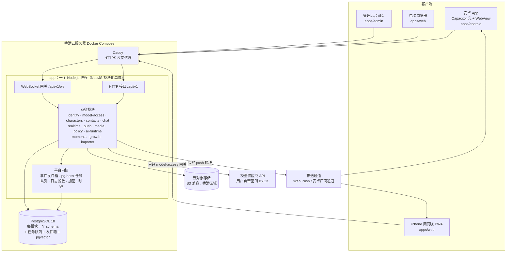
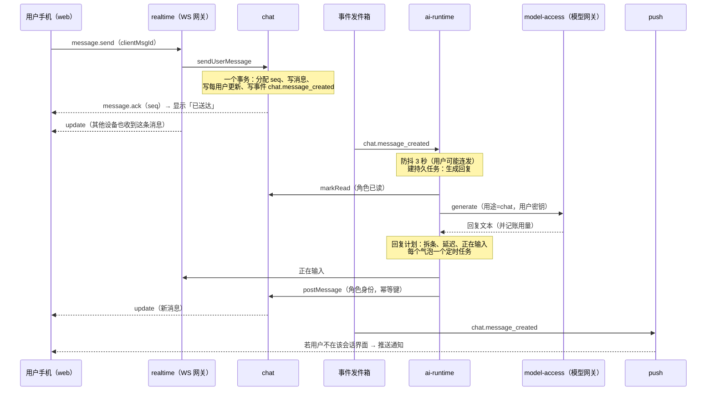

# 微伴系统架构总览

> 负责人：架构负责人 · 版本 v1.0 · 2026-10-04 · 来源任务：T-004
> 技术选型见 `docs/decisions/ADR-0003-tech-stack.md`；模块通信规则见 `ADR-0004`；消息可靠方案见 `ADR-0005` 和 `message-reliability.md`；账号与密钥安全见 `ADR-0006` 和 `security-and-privacy.md`；硬性边界执行见 `ADR-0007` 和 `hard-boundaries.md`。本文不重复这些文档的细节。

## 1. 一句话

**微伴是一个 TypeScript 写的「模块化单体」**：服务器上只跑一个程序（`apps/server`），内部按模块严格分开；手机上的安卓 App 和 iPhone 网页版用的是同一套网页界面（`apps/web`）；管理后台是另一个独立网页（`apps/admin`）。所有数据存在一个 PostgreSQL 数据库里，每个模块一个独立「文件夹」（schema）。

## 2. 系统总图

要点：
- **对外只有一个入口**：Caddy 负责 HTTPS，把 `/api/*` 转给 app，把其他路径交给静态网页文件。
- **调用外部模型只有一条路**：所有模型请求必须经过 `model-access` 模块的「模型网关」，这样密钥解密、用量记账、预算检查、错误重试只在一处实现。
- **发推送只有一条路**：所有通知经过 `push` 模块，成人模式内容隐藏、免打扰、合并通知都在这里统一执行。

## 3. 模块清单与职责

「负责人」指写这个模块代码的人。所有模块的对外接口以 `packages/contracts` 为准。

| 模块 | 职责（一句话） | 主要需求 | 层 | 负责人 | 首次出现 |
|---|---|---|---|---|---|
| `platform`（平台内核，不是业务模块） | 配置、数据库连接、事件发件箱与分发、任务队列、日志脱敏、加密工具、时钟、鉴权守卫、错误格式 | 全部 | 内核 | 后端 | L0 |
| `identity` 账号 | 注册（邀请码）、登录、设备会话、我的资料、年龄确认、全局通知与免打扰设置、管理员角色、注销 | ACC-01～06 | 底层 | 后端 | L0 |
| `realtime` 实时与同步 | WebSocket 网关、在线与「正在看哪个会话」、**每用户更新日志**（多端同步的核心）、补拉接口、「正在输入」转发 | CHAT-03、CHAT-06、ACC-01 | 底层 | 后端 | L1 |
| `push` 推送 | 设备推送凭证、通知内容组装与合并、免打扰判断、成人模式隐藏内容、对接 Web Push 和安卓推送通道 | CHAT-10、ACC-03、SAFE-07 第 3 条 | 底层 | 后端（安卓通道细节与 Android 负责人共建） | L1 |
| `media` 媒体 | 上传、存储、缩略图、带签名的访问链接；素材库文件 | ACC-02 头像、MED、ADM-04 | 底层 | 后端 | L0（头像） |
| `model-access` 密钥与模型 | 密钥加密保存与连通测试、模型目录与排行榜数据、模型选择（聊天 / 后台 / 成人，按角色覆盖）、**模型网关**（唯一调用供应商的地方）、用量记账、后台预算、供应商故障状态 | MDL-01～06 | 中层 | 后端（密钥存储、接口）+ AI（供应商适配、费用估算、排行榜数据） | L0 |
| `characters` 角色库 | 预设与自定义角色、角色分类、角色卡存储（结构由 AI 负责人定义）、人设版本、公开资料、公开动态、关系网、上架流程、我的补充设定 | CHR-01/02/07/09/10/11、ADM-01/02/03/06、SIM-03、SOC-01 | 中层 | 后端 | L0 |
| `contacts` 通讯录 | 用户与角色的「好友关系」：添加与通过、备注、自定义头像、认识日期、删除与 30 天恢复、关系类型、专属称呼、名片推荐冷却 | CHR-03～06、GRW-01/02 | 中层 | 后端 | L1 |
| `chat` 会话与消息 | 私聊与群聊、参与者（用户或角色，一视同仁）、消息与递增序号、幂等、撤回、已读游标、置顶免打扰、清空、群成员管理 | CHAT-01～03、CHAT-13（通用部分）、SOC-03 | 中层 | 后端 | L1 |
| `policy` 硬性边界 | 根据角色分类推导「成人模式资格、能否生成形象、能否恋爱」等，所有相关写操作和 AI 生成前都要过它；无自有业务表，只有审计日志 | 第 10 章、MODE-03 | 中层 | 规则由架构定义，后端实现 | L0 |
| `ai-runtime` AI 运行时 | 角色怎么说话、什么时候说：上下文构建、记忆、回复计划（节奏、拆条、人设小巧思）、安全关怀识别、情景模式、推演、主动消息调度、群聊发言调度、识图与语音编排、陪伴设置（秒回、拆条、贴合度、情景模式、主动消息频率） | CHAT-04～09/14、MEM、SIM、SOC-02/04～06、MED、SAFE-06/08、MODE | 上层 | **AI 系统负责人**（内部设计见 `docs/ai/`） | L1 |
| `moments` 朋友圈 | 动态、点赞、评论、可见范围、新动态红点 | SOC-07～09 | 上层 | 后端（数据）；内容生成由 ai-runtime 通过端口写入 | L4 |
| `growth` 养成 | 熟悉度、认识天数与纪念日、卡片、成就 | GRW-03～06 | 上层 | 后端 | L3 |
| `importer` 导入 | 导入聊天记录、发言人识别、原文加密暂存与按期删除、生成草稿任务 | CHR-08、CHR-09 | 上层 | 后端（文件与删除）+ AI（分析生成） | L6 |
| `library` 收藏与分享 | 收藏、分享图数据准备（过滤成人内容、带标注标记） | CHAT-11、EXP-01 | 上层 | 后端 | L6 |

不设独立的「管理后台模块」：每个模块在自己的 `admin` 子路由下提供管理接口（统一要求管理员身份），管理后台网页 `apps/admin` 调用这些接口（见 `prd-answers.md` 第 5 问）。

聊天记录搜索（CHAT-12）放在 `chat` 模块内部实现。

## 4. 数据域划分（每个模块拥有哪些数据）

规则（ADR-0004）：**只有拥有者能读写自己的表**；跨模块只存对方 ID；要别人的数据调端口，要知道变化订阅事件。表名是规划，字段由各模块负责人在实现时设计、在交接说明中列出。

| 模块 | PostgreSQL schema | 拥有的数据（主要表） | 敏感级别 |
|---|---|---|---|
| platform | `platform` | `outbox`（待投递事件）、`event_inbox`（订阅者已处理记录）、`audit_log`（管理操作和边界判定审计）、`user_data_keys`（每用户数据密钥，被主密钥加密，见 `security-and-privacy.md`）；`pgboss` schema 由 pg-boss 自管 | 中 |
| identity | `identity` | `users`（用户名、密码哈希、角色 user/admin）、`invites`（邀请码）、`sessions`（设备会话，令牌只存哈希）、`profiles`（昵称、头像、生日、性别、城市、关于我、时区）、`age_confirmations`、`notification_settings` | 高（密码哈希、个人资料） |
| realtime | `realtime` | `user_updates`（每用户递增的更新日志，保留 30 天）、`user_update_cursors`（每用户最新序号）；在线状态只在内存 | 中 |
| push | `push` | `devices`（推送凭证，绑定会话）、`notification_log`（去重与合并，保留 7 天） | 中 |
| media | `media` | `objects`（文件元数据：所有者、类型、大小、存储键、用途）；文件本体在对象存储 | 中～高（用户图片、语音） |
| model-access | `model_access` | `credentials`（**加密后的密钥**、掩码、状态）、`model_catalog`、`leaderboard_entries`、`selections`（全局默认）、`character_overrides`、`usage_records`（每次调用：用途、模型、token、耗时、估算费用、计费归属）、`budgets`、`provider_status` | **最高**（密钥） |
| characters | `characters` | `characters`（基础信息、分类、状态）、`character_cards`（角色卡，按版本；公开资料条目放在卡内 `knowledge.entries`，随人设版本一起版本化和回滚，不另设表）、`persona_versions`、`public_updates`（公开动态及审核状态）、`relations`（关系网）、`user_supplements`（我的补充设定）、`categories` | 中（自定义角色、补充设定属于用户数据） |
| contacts | `contacts` | `contacts`（用户×角色：状态、备注、自定义头像、认识日期、关系类型、专属称呼、删除时间）、`card_recommendation_cooldowns` | 中 |
| chat | `chat` | `conversations`、`participants`、`messages`（含会话内递增 `seq`、`client_msg_id`、`scope`）、`read_cursors`、`user_conversation_state`（置顶、免打扰、隐藏、清空位置）、`message_hides` | **高**（聊天内容是唯一事实来源） |
| policy | 无业务表 | 判定审计写入 `platform.audit_log` | — |
| ai-runtime | `ai_runtime` | 由 AI 负责人设计（见 `docs/ai/runtime-overview.md`），预计包括：`message_annotations`（AI 对消息的附加信息：发送理由、卡片版本、小巧思类型，按 messageId 关联，**不存进 chat**）、`memories`（含向量与可见范围）、`conversation_summaries`、`agreements`、`daily_events`、`storylines`、`mood_states`、`reply_plans`（持久化的回复计划）、`proactive_ledger`（主动消息配额账本）、`companion_settings`、`safety_states` | 高（记忆含用户隐私） |
| moments | `moments` | `posts`、`post_media`、`likes`、`comments`、`visibility` | 中 |
| growth | `growth` | `familiarity`、`familiarity_ledger`、`anniversaries`、`cards`、`achievements` | 低 |
| importer | `importer` | `import_jobs`、`import_raw`（**原文，加密，默认生成后删除**） | **最高**（第三方聊天原文） |
| library | `library` | `favorites`（收藏时复制一份内容快照，原消息删了收藏还在） | 中 |

几条关键数据规则：
1. **消息是唯一事实来源**：会话里出现过的每一句话都只存在 `chat.messages`。AI 记忆、摘要、推送内容、分享图都是从消息派生的副产品，可以重建，不能反过来覆盖消息。
2. **日常事件是角色生活的唯一底稿**（PRD 原则 9）：存在 `ai_runtime.daily_events`；主动消息、朋友圈、时间线引用事件 ID，不各自编造。
3. **成人模式内容带标记**：消息和记忆都有 `scope` 字段（`normal` / `adult`），由服务器按当时的情景模式写入，客户端不能指定（见 `hard-boundaries.md`）。
4. **注销与删除**：`identity` 发出 `identity.user_deletion_requested`，每个拥有用户数据的模块必须订阅并彻底删除自己的那部分，完成后回报（见 `security-and-privacy.md`）。

## 5. 模块之间怎么通信

### 5.1 三种通道

| 通道 | 谁和谁 | 格式定义 |
|---|---|---|
| HTTP 接口 `/api/v1/*` | 客户端 ↔ 服务器（请求-响应：登录、拉历史、改设置） | `packages/contracts/src/http/` |
| WebSocket `/api/v1/ws` | 客户端 ↔ 服务器（实时：发消息、送达确认、新消息、正在输入、更新通知） | `packages/contracts/src/ws.ts` |
| 端口（同步调用） | 模块 ↔ 模块（同一进程内的函数调用） | `packages/contracts/src/ports/` |
| 领域事件（异步通知） | 模块 → 订阅它的模块（经事务性发件箱） | `packages/contracts/src/events.ts` |
| 原生桥 | 网页 ↔ 安卓原生壳 | `packages/contracts/src/bridge.ts` |

### 5.2 一条消息的完整旅程（L1 私聊）

注意：`chat` 从头到尾不知道「AI」的存在。它只知道「参与者 X 发了一条消息」。AI 运行时是众多订阅者之一，推送模块是另一个。

### 5.3 AI 运行时的对外边界（T-005 内部设计归 AI 负责人）

AI 运行时是一个模块，**对外只通过以下方式与系统交互**：

| 方向 | 方式 | 契约 |
|---|---|---|
| 收到「发生了什么」 | 订阅事件：`chat.message_created`、`chat.message_recalled`、`contacts.contact_accepted`、`model_access.credential_status_changed`、`characters.character_classification_changed`、`identity.profile_updated`、`identity.user_deletion_requested` 等 | `events.ts` |
| 读数据 | 调端口：`ChatReadPort`、`CharacterReadPort`、`ContactsReadPort`、`IdentityReadPort`、`PolicyPort` | `ports/` |
| 以角色身份说话 | 调端口：`ChatParticipantPort.postMessage / markRead / setTyping` | `ports/chat.ts` |
| 调用模型 | **只能**调端口：`ModelGatewayPort.generate`（带用途、模型角色、幂等键） | `ports/model-gateway.ts` |
| 对用户开放的接口 | 陪伴设置、记忆页、时间线等 HTTP 接口，由 AI 负责人提出、架构批准后写进契约 | `http/companion.ts`（L1 先有秒回和拆条） |
| 定时与延迟 | 使用平台内核的 pg-boss 任务队列（队列名以 `ai.` 开头） | — |

AI 运行时**不能**：直接读写 `chat` 等其他模块的表；绕过模型网关调用供应商；自行判定成人模式资格（必须问 `policy`）；给推送模块指定通知文案以外的投递策略。

### 5.4 端口清单（L0/L1）

| 端口 | 提供方 | 主要调用方 | 作用 |
|---|---|---|---|
| `IdentityReadPort` | identity | 全部 | 读资料、时区、通知设置、年龄确认状态 |
| `CharacterReadPort` | characters | ai-runtime、policy、contacts | 读角色基础信息、分类、角色卡、补充设定 |
| `ContactsReadPort` | contacts | ai-runtime、policy、push | 是否已添加、备注名、关系类型 |
| `ChatReadPort` | chat | ai-runtime | 读会话、参与者、消息（必须指定可见范围） |
| `ChatParticipantPort` | chat | ai-runtime、contacts（系统提示） | 以参与者身份发消息、标记已读 |
| `ChatAdminPort` | chat | contacts、ai-runtime | 创建私聊会话、发系统提示 |
| `SyncPort` | realtime | chat、contacts、model-access 等 | 在事务里写「每用户更新」；查询用户是否正在看某会话；转发正在输入 |
| `PushPort` | push | （一般通过事件触发，少数直接调用） | 发送通知 |
| `ModelGatewayPort` | model-access | ai-runtime、importer | 调用模型（唯一出口） |
| `PolicyPort` | policy | characters、ai-runtime、chat、media、library | 硬性边界判定 |

## 6. 运行形态

- **一个进程**：HTTP、WebSocket、事件分发、任务执行都在 `app` 进程里。代码支持用环境变量 `APP_ROLE=web|worker|all` 拆成两个进程（同一镜像），默认 `all`。
- **时间**：服务器一律存 UTC；用户时区存于资料，每次连接时客户端上报设备时区（SIM-04 以设备时区为准）。所有「今天」「活跃时段」「认识第 N 天」按用户时区计算。业务代码禁止直接读系统时间，统一用平台时钟（测试可以拨快时间）。
- **本地向量模型**（AI 负责人申请，2026-10-04 批准）：记忆检索用的小型中文向量模型在服务器本机运行，不走用户密钥。为保持「一种语言」，在 app 进程内用 Node 的 ONNX 推理库加载（放在独立工作线程，避免阻塞接口），向量存 PostgreSQL 的 pgvector。服务器配置因此建议 **不低于 2 核 4 GB 内存**（运维选型时按此）。若实测资源不够，按 AI 方案退化为「全文检索 + 重要度 + 新近度」。
- **配置与机密**：运行配置从环境变量读取；主密钥等机密由运维放在服务器的机密文件中，不进仓库、不进数据库（见 `security-and-privacy.md`）。

## 7. 相关文档

| 文档 | 内容 |
|---|---|
| `repo-structure.md` | 仓库目录、构建产物 |
| `engineering-standards.md` | 命名、代码风格、测试、日志、数据库迁移规范 |
| `message-reliability.md` | 消息可靠收发与多端同步（PRD 8.1 第 2 问） |
| `security-and-privacy.md` | 账号、密钥加密、日志脱敏、彻底删除（第 1、3 问） |
| `hard-boundaries.md` | 硬性边界的系统级执行（第 9 问） |
| `prd-answers.md` | PRD 8.1 九个问题的回答汇总 |
| `dev-plan.md` | L0～L6 开发任务清单 |
| `tech-debt.md` | 技术债登记 |
