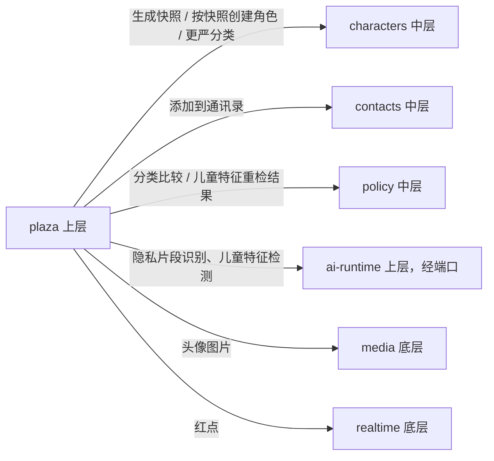

# 人设广场：模块、数据结构与分类锁定

> 负责人：架构负责人 · v1.0 · 2026-10-05 · 来源任务：T-020
> 需求来源：PRD v1.3 第 15 章 PLZ-01～PLZ-08、ADM-09；总负责人裁定 C1（`docs/product/input/2026-10-04-pm-rulings-2.md`）。
> 本文只讲**系统怎么做**，不改产品规则。硬性边界在广场上的执行规则见 `hard-boundaries.md` 第 6 节（本文引用，不重复）；广场隐私检查的识别方法归 AI 负责人。
> 所属层：L7（`dev-plan.md`）。契约在 D-L7-01 写入，本文是契约的设计输入。

## 1. 结论（先看这段）

1. 新建一个 **`plaza` 模块**（上层），拥有作品、版本快照、点赞、评论、举报、广场昵称、复制关系这些数据。角色本身仍归 `characters`，广场不碰角色表。
2. **发布的是快照**：发布时由 `characters` 按「白名单」生成一份只读快照交给广场保存；作者之后怎么改角色，广场上的作品都不变，直到作者点「发布新版本」。
3. **复制是 `characters` 新建一个自定义角色**，分类由服务器从快照写入并**锁定**（只能更严），客户端没有任何字段能影响分类。
4. **快照的内容范围由契约里的严格 schema 决定**：多一个字段都校验失败。聊天记录、记忆、我的资料等「永不发布」的东西根本不在 schema 里，无从泄露。
5. 「基于身边真人」的角色不能发布（裁定 C1），由 `characters` 维护的只增标记 `everPrivatePerson` 执行。

## 2. 模块与依赖

| 方向 | 说明 |
|---|---|
| plaza → characters | `CharacterPlazaPort`（D-L7-01 新增）：`buildPublishSnapshot(userId, characterId)`、`buildVariantSnapshot(userId, presetCharacterId)`、`createFromSnapshot(userId, snapshot, origin)`、`applyVariant(userId, presetCharacterId, supplementText, origin)`、`tightenClassification(characterId, classification, reason)`（管理员更正用）、`getPlazaOrigin(characterId)` |
| plaza → contacts | 复制后走 CHR-03 添加流程（与用户手动添加相同的入口方法，受通讯录上限 P-26 约束） |
| plaza → ai-runtime | 同为上层，**单向**：plaza 调 ai-runtime 提供的检测端口（隐私片段识别、儿童特征检测，费用从发布者余额扣，用途 `import_analysis`，PLZ-02 第 7 条）；ai-runtime 不 import plaza（R11 循环检查会拦下反向依赖） |
| characters → plaza | **没有**。characters 不知道广场存在；「作者删除了原角色」之类的变化，广场订阅 `characters.*` 事件得知 |

## 3. 数据（schema `plaza`）

| 表 | 主要字段 | 说明 |
|---|---|---|
| `author_profiles` | `user_id`、`plaza_nickname`（≤12 字）、`avatar_media_id`、`publish_banned_until`、`ban_reason` | 第一次发布或评论时创建（PLZ-02 第 2 条）；停止发布权限（ADM-09 第 4 条） |
| `works` | `work_id`、`author_user_id`、`kind`（`custom_character` / `preset_variant`）、`source_character_id`（作者自己的角色或补充设定所属的预设角色）、`based_on_preset_id`（预设改版）、`origin_work_id`（改编自，PLZ-04 第 6 条）、`current_version`、`status`（`listed` / `unlisted_by_author` / `removed_by_admin`）、`allow_remix`、`comments_open`、`like_count`、`adopt_count`、`comment_count`、`created_at` | 一个自定义角色 / 一份补充设定只对应一个作品（PLZ-02 第 9 条，唯一约束） |
| `work_versions` | `work_id`、`version`、`snapshot`（JSON，见第 4 节）、`classification`（快照中分类的冗余列，便于筛选和比较）、`change_note`、`created_at` | **只增不改**；作品页的版本记录 |
| `adoptions` | `adoption_id`、`user_id`、`work_id`、`version`、`kind`（`copy` / `apply`）、`character_id`（复制得到的新角色，或被应用改版的预设角色）、`created_at`、`update_dismissed_version` | 「已添加」状态、新版本提示（PLZ-05 第 4 条）、管理员更正时找出所有下游角色（ADM-09 第 6 条） |
| `likes` | `work_id`、`user_id`、`created_at` | 唯一约束（每人每作品一次） |
| `comments` | `comment_id`、`work_id`、`author_user_id`、`reply_to_comment_id`、`text`（≤ P-35）、`deleted_at`、`deleted_by` | 只有一层回复 |
| `reports` | `report_id`、`reporter_user_id`、`target_kind`（work / comment）、`target_id`、`reason`、`note`、`status`、`resolution`、`resolved_by`、`resolved_at` | 唯一约束（同一用户同一对象一次） |
| `badges` | `user_id`、`kind`、`target_id`、`created_at` | 「我发布的」红点；不发推送（PLZ-03 第 4 条） |

- 热门排序（P-34）按「最近 7 天」实时计算：个人测试规模下直接对 `likes`、`adoptions`、`comments` 按时间窗口聚合即可，不建汇总表；数据量大了再加每日汇总（届时登记技术债）。
- 搜索（角色名、标签、作者昵称、基于的预设角色名）：v1 用 PostgreSQL `ILIKE` / `pg_trgm`（个人测试规模足够）；中文分词方案与 TD-010 一起评估。
- 注销（PLZ-06 第 4 条）：删除该用户的作品、版本、评论、点赞、举报、广场资料；**不删除**别人的 `adoptions` 和复制得到的角色（它们属于复制者）；来源标注里的作者显示「已注销用户」（按 `author_user_id` 找不到资料即显示该文字）。

## 4. 快照：白名单在契约里

快照是一个**严格**的 Zod 对象（`.strict()`，多余字段即校验失败），由 `characters` 生成、`plaza` 保存前再校验一次。D-L7-01 写入契约，字段严格按 PLZ-02 第 3 条：

| 自定义角色快照 | 预设改版快照 |
|---|---|
| 名字、分类（`basis`、`realPersonKind`、`ageSetting`、`childAppearance`、`childFeaturesDetected`、`everPrivatePerson`）、人设描述、说话方式、口头禅、示例对话、人设标签、角色生日、音色名称、头像（媒体 ID，真人分类强制为空，`hard-boundaries.md` 第 6 节第 8 条） | 基于的预设角色 ID（引用，不复制预设内容）、改版设定文字 |
| 两者共有：一句话介绍（≤30 字）、发布说明（≤300 字）、`allowRemix`、`commentsOpen` | |

- 「永不发布」清单（PLZ-02 第 4 条）中的任何东西都**不在 schema 里**；`characters` 生成快照时只读这些白名单字段，不读记忆、聊天、通讯录、growth、health 等任何别的模块。
- **隐私检查**（PLZ-02 第 6 条）：广场把将要发布的文字交给 AI 的识别端口，得到疑似私人信息的片段位置；用户在确认页逐条处理；最终保存的快照里，未被用户确认保留的片段替换为「▢」。识别时需要的「我的昵称、专属称呼、关于我、记忆里关于我的事实」由 AI 端口自己通过已有端口读取（广场不经手这些数据）。识别方法、「宁可多标」的评测归 AI 负责人。
- 头像图片：快照只存媒体 ID；发布时 `media` 把这张图的可见范围扩大为「广场公开」（新增用途，D-L7-01 契约）；作品删除后恢复为只有作者可见。

## 5. 关键流程

### 5.1 发布 / 发布新版本

1. 校验：作者未被停止发布权限；作品未被管理员下架；若是复制来的角色，原作品 `allow_remix = true`（PLZ-04 第 6 条）；`everPrivatePerson = false`（裁定 C1）。
2. 儿童特征重检（扣发布者余额；余额不足提示「暂时无法发布」，不跳过，PLZ-02 边界情况）→ 结果写回源角色。
3. `characters.buildPublishSnapshot` 生成快照 → 隐私检查确认页 → 用户确认。
4. 新版本：调用 policy 的分类比较，新快照分类必须「不比上一版宽」（`hard-boundaries.md` 第 6 节第 5 条）。
5. 写 `works` / `work_versions`（一个事务，发事件 `plaza.work_published`）。

### 5.2 添加为我的角色（复制）

1. 读作品当前版本快照。
2. `characters.createFromSnapshot`：新建自定义角色，`origin = { kind: plaza_copy, workId, version }`，分类从快照写入（预设改版：取该预设角色**当前**人设版本与分类，再合并改版设定，PLZ-04 第 1 条）。
3. 走 contacts 的添加流程（「通过了你的好友申请」→ 第一条消息）。
4. 写 `adoptions`，作品 `adopt_count + 1`。
5. 步骤 2～4 不能放进同一个数据库事务（跨模块），用幂等键（`adoption_id`）保证重试不会创建两个角色：characters 和 contacts 都以它作为幂等键。

### 5.3 应用改版

`characters.applyVariant` 把改版设定写入「我的补充设定」（替换前由客户端确认）；未添加该预设角色时先走添加流程。补充设定是自由文本，不影响分类（`hard-boundaries.md` 第 2 节末段）。

### 5.4 新版本提示与更新（PLZ-05 第 4 条）

作者发布新版本 → 事件 `plaza.work_version_published` → 广场给所有 `adoptions` 中该作品的用户写红点（`badges`）。用户点「更新」：复制品调用 `characters` 用新快照**替换人设类字段**，分类只会更严（新版本本身已保证不放宽；若更严，characters 照常发分类变化事件，ai-runtime 退出成人模式）；应用改版的用户替换补充设定。聊天、记忆、熟悉度等不动（它们本来就不在广场和快照里）。

### 5.5 下架、删除、管理员操作

- 作者下架 / 删除、管理员下架、停止发布权限：只改 `works.status` / `author_profiles`；不影响已复制的角色（PLZ-06 第 3 条）。
- 管理员更正分类：见 `hard-boundaries.md` 第 6 节第 6 条；顺着 `adoptions` 和 `works.origin_work_id`（改编链）找到全部下游角色，逐个调用 `characters.tightenClassification`；每个操作写审计日志（ADM-09 第 7 条）。

## 6. 契约（D-L7-01 写入，本文是输入）

- HTTP：`/api/v1/plaza/works`（列表、搜索、排序、筛选）、`/plaza/works/:id`（作品页、版本记录）、发布 / 新版本 / 下架 / 删除、点赞、评论、举报、添加、应用、更新、「我发布的」、广场资料；管理端 `/api/v1/admin/plaza/*`（ADM-09）。
- 端口：`CharacterPlazaPort`（第 2 节）、AI 的隐私识别端口（AI 负责人提变更申请）、policy 的分类比较函数。
- 事件：`plaza.work_published`、`plaza.work_version_published`、`plaza.work_removed`。
- 媒体用途：广场公开头像。

## 7. 已知限制

- 系统只信分类字段，不检测灵感来源（`hard-boundaries.md` 第 2 节）：用户若手工新建角色、把别人作品的人设文字粘贴进去、自选「原创」，这是「创建」而不是「复制」，分类由用户负责（PRD 10.0、CHR-07）。广场能保证的是：**经广场复制**的路径无法放宽分类。
- 用户自定义的「历史人物」不带来古风插画形象（`hard-boundaries.md` 第 2 节），所以这类作品在广场上显示非肖像默认头像。
