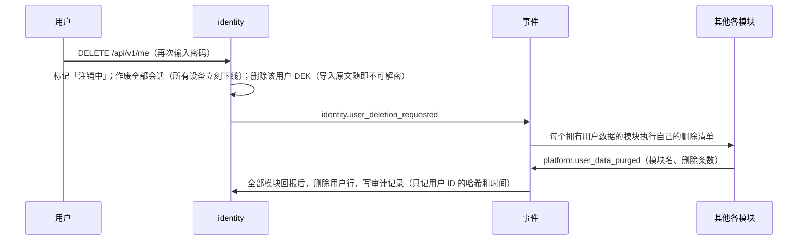

# 账号、密钥安全、日志脱敏与彻底删除

> 负责人：架构负责人 · v1.2 · 2026-10-05 · 来源任务：T-004，T-009 修订，T-020 修订（经期日记用用户数据密钥加密，详见 `health-data.md`）
> 回答 PRD 8.1 第 1 问（登录方式）、第 3 问（密钥加密、日志脱敏、注销彻底删除及验证方法）、第 6 问中的「导入原文删除」。决策记录见 `docs/decisions/ADR-0006-auth-and-secrets.md`；平台上游密钥见 `ADR-0012`。
> v1.1 改动：BYOK 取消，需要加密保存的「API 密钥」从「用户自己的密钥」变为「管理员登记的平台上游密钥」（第 3 节）；客户端增加安卓原生 App（令牌存储见第 2 节）。

## 1. 结论

1. **登录**：用户名 + 密码；**注册需要邀请码**（管理员生成），因为服务器在公网上，不能让陌生人随便注册。不需要手机号、邮箱、微信 / QQ。
2. **密钥**：平台上游密钥（调用各家模型的 API 密钥，只有管理员能录入）用「信封加密」保存——平台有一把数据密钥加密这些 API 密钥，数据密钥再被服务器主密钥加密；用户的导入原文用每个用户自己的数据密钥加密。主密钥只存在服务器的机密文件里，**不在数据库、不在备份、不在代码仓库**。单独偷走数据库或备份，拿不到任何一把 API 密钥。
3. **日志**：从源头不写敏感字段 + 日志器自动打码兜底 + 模型请求错误统一「消毒」后再记录。
4. **注销**：请求时立即让所有设备下线；其余数据由各模块按「删除清单」彻底删除，逐个模块回报，全部完成才算注销完成。备份中的残留在备份保留期满后自然消失。
5. **验证**：用「金丝雀」值（一段独一无二的假密钥 / 假文字）走一遍流程，再在日志、数据库导出中搜索，必须搜不到。

术语：
- **哈希**：把密码变成一串无法还原的乱码，登录时比对乱码而不是密码本身。我们用 argon2id（目前推荐的密码哈希算法）。
- **信封加密**：用「小钥匙」锁数据，再用「大钥匙」锁小钥匙。好处是换大钥匙时只要重新锁小钥匙，不用重新加密所有数据。
- **AES-256-GCM**：一种标准的加密方式，既能加密又能发现数据被篡改。
- **金丝雀**：故意放进去的、一眼能认出的测试值。如果它出现在不该出现的地方，就说明有泄露。

## 2. 账号与会话（ACC-01）

| 项 | 规则 |
|---|---|
| 注册 | 用户名（4–32 位字母数字下划线）+ 密码（至少 10 位）+ 邀请码。邀请码由管理员在后台生成，一次性、可设有效期。第一个管理员账号由运维在服务器上用命令行脚本创建 |
| 密码存储 | argon2id 哈希，只存哈希 |
| 防暴力破解 | 同一用户名或同一 IP 连续 5 次失败，锁定 15 分钟 |
| 会话令牌 | 登录成功发一个 256 位随机令牌，**数据库只存它的 SHA-256 哈希**；每台设备一个会话；90 天内有使用则自动续期（像微信一样长期保持登录） |
| 令牌携带 | HTTP 用 `Authorization: Bearer` 请求头；WebSocket 连接后第一帧发送，不放在 URL 里（URL 会进访问日志）。不用 Cookie（安卓原生客户端与网页统一用请求头，一套规则） |
| 令牌存放 | 网页：IndexedDB（`engineering-standards.md` 第 8 节）；安卓：Android Keystore 保护的加密存储，不写日志、不进备份（关闭该文件的系统自动备份） |
| 多设备 | 一个账号可多台设备同时登录；「设置 → 登录设备」可查看并踢下线 |
| 退出登录 | 删除该会话，同时删除绑定在该会话上的推送设备凭证（ACC-01 验收第 3 条） |
| 忘记密码 | 无邮箱 / 短信找回。个人测试阶段由管理员在服务器上用命令行脚本重置；记入技术债，若开放给他人需补找回方式 |
| 管理员 | 用户表上的 `role = admin`；管理后台登录产生独立的管理会话（12 小时过期）；所有 `/api/v1/admin/*` 接口在服务器端检查管理员身份 |

为什么不用其他方式：手机号 / 第三方账号被 PRD 排除；邮箱需要配置发信服务且仍可能被当成实名信息；通行密钥（Passkey，用指纹 / 面容登录）体验最好，安卓原生客户端可直接使用系统凭据管理器，但网页 / iPhone PWA 与安卓两套行为要分别适配，作为以后的增强项（技术债 TD-002）。

## 3. 密钥加密存储（MDL-01）

### 3.1 结构

```
主密钥 KEK（32 字节随机数）
  └─ 存放：服务器机密文件（Docker secret，路径由环境变量 PLATFORM_KEK_FILE 指定）
  └─ 离线备份：由运维单独保存（例如总经理的密码管理器），与数据库备份分开
        │ 加密
        ▼
数据密钥 DEK（32 字节随机数）：平台一把（owner = platform，用于上游密钥）+ 每个用户一把（用于该用户的导入原文）
  └─ 存放：platform.user_data_keys（只存被 KEK 加密后的密文 + kek_version）
        │ 加密
        ▼
平台上游密钥、用户导入的原始聊天记录、经期日记（v1.2）
  └─ 存放：model_access.upstreams.secret_ciphertext（平台 DEK）、importer.import_raw（用户 DEK）、health.period_entries / period_settings 的 payload（用户 DEK，`health-data.md`）
  └─ 算法：AES-256-GCM，每条记录独立随机 nonce
  └─ 附加认证数据（AAD）：上游密钥用 `upstream:{upstreamId}`，导入原文用 `import:{jobId}:{userId}`，经期日记用 `health:{entryId}:{userId}` —— 把密文和这一行绑定，挪到别的行就解不开
```

### 3.2 规则

1. 保存时同时记下**掩码**：前 4 位和后 4 位单独存为 `display_prefix`、`display_suffix`。管理后台只显示掩码。
2. **解密只发生在模型网关里**，且只在发请求那一刻在内存中解密，用完即弃，不缓存明文。
3. **任何接口都不返回密钥原文或密文**：契约里的上游响应对象根本没有这个字段（`packages/contracts/src/http/model-access.ts` 的 `Upstream`）。
4. 管理员粘贴的密钥只在「登记 / 更换」请求里经 HTTPS 上传一次；管理后台不保存。
5. **平台密钥的额外保护**（它能直接产生真实费用）：只有管理会话能调用上游接口；每次登记 / 更换 / 删除写审计日志；运维在每家供应商控制台设置消费上限和余额告警；平台每日总消费上限兜底（`billing.md` 第 7 节）。
6. 主密钥轮换：生成新 KEK，脚本把所有 DEK 用新 KEK 重新加密（`kek_version` 加一），API 密钥本身不用动。
7. 平台内核 `platform/crypto` 提供统一的 `seal(userId, aad, plaintext)` / `open(...)`，任何模块不得自己写加密代码。

### 3.3 防住什么、防不住什么

| 情况 | 结果 |
|---|---|
| 数据库或备份文件被单独拿走 | 安全：没有 KEK，解不开任何密钥 |
| 日志被看到 | 安全：日志里没有密钥（第 4 节） |
| 服务器被完全攻破（拿到 root） | **防不住**：攻击者能读到 KEK，进而解出平台上游密钥并产生真实费用。单机部署接受这个风险；应对：服务器加固由运维负责；供应商控制台消费上限把损失封顶；发现异常时管理员在供应商处作废密钥 |

## 4. 日志脱敏

三道防线：

1. **源头不写**（最重要）：工程规范（`engineering-standards.md` 第 6 节）禁止把密钥、令牌、密码、聊天正文、记忆、导入原文写进日志。代码评审重点检查。
2. **日志器自动打码**：平台日志器（pino）配置：
   - 按字段名打码：`authorization`、`apiKey`、`secret*`、`password`、`token`、`content`、`text`、`prompt`、`messages` 等字段的值替换为 `[REDACTED]`；
   - 按内容打码：所有日志字符串过一遍正则，常见密钥形态（如 `sk-` 开头的长串、`Bearer xxx`、连续 32 位以上的字母数字串）替换为 `[REDACTED]`。
3. **模型错误消毒**：供应商返回的错误信息有时会回显部分密钥。模型网关把错误统一转换为 `{供应商, HTTP 状态码, 错误类别}`，原始错误文本经正则打码并截断到 200 字后才允许记录。

另外：
- Caddy 访问日志保持默认（默认不记录 Authorization 请求头），**禁止打开** `log_credentials`。
- 前端不接入任何第三方统计、错误上报服务。
- 开发环境调试模型请求全文的开关 `DEBUG_LLM_PAYLOAD` 在生产环境被代码强制关闭。

## 5. 彻底删除

### 5.1 注销账号（ACC-06）



规则：
1. 每个拥有用户数据的模块**必须**实现「删除清单」接口：`purgeUser(userId)`（删除本模块全部相关数据，包括对象存储里的文件）和 `countUserData(userId)`（返回剩余条数，用于验证）。新模块不实现就不能合并。
2. 删除清单任务失败会自动重试；管理后台可看到「注销未完成」的账号。
3. 必须是**物理删除**（真正删掉行），不是打标记。
4. **备份**：注销前产生的数据库备份里仍有该用户数据，备份按运维定的保留期（建议不超过 14 天）滚动删除后彻底消失。主密钥不在备份里，但每用户数据密钥在，所以备份期内理论上可恢复；这一点在注销确认页无需展示（个人测试），但写在此处作为已知事实。

### 5.2 删除单个角色（CHR-06）

- 默认软删除，保留 30 天；到期由 `contacts` 模块的定时任务发 `contacts.contact_purged` 事件，chat、ai-runtime、growth 等模块各自删除该用户与该角色相关的数据。
- 「立即彻底删除」直接发 `contacts.contact_purged`。

### 5.3 导入原文（CHR-08 第 6 条）

1. 原文上传后用用户 DEK 加密存入 `importer.import_raw`（大文件存对象存储，文件同样先加密）。
2. 生成草稿的任务结束时，若用户没有勾选「保留原文」，**在同一个任务里**删除原文行和文件，并在 `import_jobs.raw_deleted_at` 写入时间。
3. 兜底清扫：每小时一次的定时任务删除所有「未勾选保留、创建超过 24 小时」的原文（防止任务中途失败留下残留）。
4. 原文从不进入日志、事件载荷、模型调用记录。

## 6. 验证方法（交给质量负责人）

| 要验证什么 | 方法 |
|---|---|
| 平台密钥不泄露 | 自动化测试：用金丝雀密钥 `sk-weiban-canary-<随机串>` 配合假上游，走完「管理员登记上游（成功 / 失败）→ 用户聊天 → 上游报错 → 更换密钥 → 删除上游」全流程；然后在 ① 应用日志 ② Caddy 日志 ③ `pg_dump` 导出的纯文本数据库 ④ 所有接口响应 中搜索金丝雀全文，**出现次数必须为 0**；接口响应中只允许出现前 4 后 4 位 |
| 注销后查不到（ACC-06 验收） | ① 注销前用该账号发一条含唯一金丝雀短语的消息、产生至少一条扣费流水 ② 执行注销 ③ 运行脚本 `scripts/verify-user-purged`（后端实现）：调用每个模块的 `countUserData`，并列出对象存储中该用户目录，全部必须为 0 ④ `pg_dump` 后搜索金丝雀短语和用户名，出现次数为 0 ⑤ 原账号登录返回失败 |
| 导入原文已删除（CHR-08 验收第 3 条） | 导入一段含金丝雀短语的文本，生成草稿后：`import_jobs.raw_deleted_at` 有值、`import_raw` 中该任务无行、对象存储无文件、`pg_dump` 搜索金丝雀为 0（摘取到草稿示例对话中的句子除外，测试文本应把金丝雀放在不会被摘取的位置，或断言只出现在草稿表） |
| 退出登录后不再推送（ACC-01） | 退出后检查 `push.devices` 中该会话的设备已删除；再触发角色消息，假推送通道收不到该设备的请求 |
