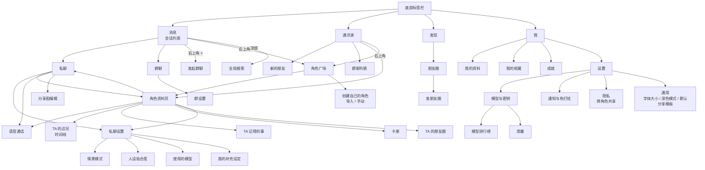

# 交互流程与信息架构（第 2 步：交互流程）

| 项 | 内容 |
|---|---|
| 负责人 | design-lead |
| 任务 | T-006 |
| 日期 | 2026-10-04 |
| 依据 | `docs/product/user-flows.md`（用户一步步做什么）、`01-requirements.md` |

> 本文回答「页面怎么组织、怎么跳转、手怎么操作」。用户流程的业务分支以 `docs/product/user-flows.md` 为准，这里只补充界面层的走法。

## 1. 结论

- 底部 4 个标签：**消息 / 通讯录 / 发现 / 我**，与微信的「微信 / 通讯录 / 发现 / 我」一一对应（第一个标签不叫「微信」，叫「消息」）。
- 页面只有三种打开方式：**推入**（从右滑入，用于下一级页面）、**底部弹层**（从下滑入，用于选择和短操作）、**全屏覆盖**（来电、通话、图片查看、分享图编辑）。
- 返回永远有两条路：左上角返回按钮 + 系统手势（安卓返回键 / iPhone 左边缘右滑）。

## 2. 信息架构（页面地图）



### 发现页内容

| 项 | 说明 |
|---|---|
| 朋友圈 | 有新动态时右侧显示最新发圈角色的小头像 + 红点（SOC-07） |
| 角色广场 | 第二个入口（通讯录右上角是第一个），方便逛 |

微信发现页的其他项（视频号、小程序等）不做（PRD 不做清单）。

### 「我」页内容

头部：我的头像、昵称 → 我的资料。列表：我的收藏、成就、设置。

## 3. 导航模式

| 模式 | 动画 | 用于 | 关闭方式 |
|---|---|---|---|
| 推入 | 新页从右侧滑入，旧页向左轻移并压暗（见 `motion.md` M-01） | 所有下一级页面 | 返回按钮、系统返回、iPhone 左边缘右滑 |
| 底部弹层 | 从底部滑入 + 背景遮罩淡入（M-03） | 长按后的更多操作、选择模板、确认类操作、表情面板以外的选择 | 点遮罩、下滑、取消按钮、系统返回 |
| 对话框 | 缩放 + 淡入（M-04） | 二次确认（删除角色、换模型提醒、注销） | 按钮；系统返回 = 取消 |
| 全屏覆盖 | 从底部滑入（来电为淡入） | 来电、通话中、图片查看、分享图编辑、首次引导 | 页面内关闭 / 挂断按钮 |
| 轻提示 | 从顶部或中部淡入，2 秒后消失（M-06） | 「已收藏」「已复制」「获得成就」 | 自动消失 |

规则：
1. 弹层最多叠一层。需要第二层时改为推入新页面。
2. 标签栏只在 4 个一级页面显示；进入任何二级页面时隐藏。
3. 从推送进入会话：直接打开会话页，返回时回到会话列表（不是退出应用）。

## 4. 手势清单（与微信对齐）

| 手势 | 位置 | 效果 | 需求 |
|---|---|---|---|
| 点击 | 会话行 | 进入会话 | CHAT-01 |
| 左滑 | 会话行 | 露出「标为未读 / 删除」（删除只移除会话入口，见 `components.md` 3.2） | CHAT-01 |
| 长按 | 会话行 | 弹出菜单：置顶、标为未读、免打扰、删除 | CHAT-01 |
| 长按 | 消息气泡 | 气泡上方弹出操作菜单：复制、收藏、引用、多选、撤回（自己 2 分钟内）、删除 | CHAT-02 |
| 双击 | 角色头像（聊天中） | 拍一拍 | CHAT-02 |
| 点击 | 角色头像（聊天中） | 进入角色资料页 | CHR-02 |
| 长按 | 群聊中角色头像 | 在输入框插入「@名字 」 | SOC-04 |
| 按住 | 「按住 说话」按钮 | 录音；上滑取消；松开发送 | MED-03 |
| 下拉 | 聊天页顶部 | 加载更早的消息 | — |
| 下拉 | 朋友圈 | 刷新 | — |
| 左边缘右滑 | 任何二级页（iPhone 主屏幕应用需要自己实现；安卓用系统返回手势；电脑浏览器不需要） | 返回上一页 | — |
| 下滑 | 底部弹层 | 关闭 | — |
| 双指缩放 / 双击 | 图片查看 | 放大缩小 | — |

冲突处理：会话行左滑与 iPhone 左边缘右滑方向相反，不冲突；左边缘 20px 内的触摸优先判定为返回手势。

## 5. 核心流程的界面走法

### 5.1 首次使用（对应用户流程 1，ACC-04：不超过 5 次跳转）

```
① 登录页 → ② 填写昵称（全屏引导页 1/2）→ ③ 配置模型（引导页 2/2，可「稍后」）
→ ④ 角色广场（引导模式：顶部提示「先加一个你喜欢的 TA 吧」）→ 角色资料页底部「添加」直接弹出打招呼弹层（不另开页）
→ ⑤ 私聊（等待「通过好友申请」期间，会话页显示系统提示「已发送好友申请」）
```

跳转计数：登录 → 昵称 → 模型 → 广场 → 资料页 → 私聊，资料页的添加用弹层完成，共 5 次跳转。

iPhone 网页版：进入私聊后、收到第一条消息后，底部弹层显示「添加到主屏幕」图文引导（ACC-05），只出现一次。

### 5.2 添加角色（用户流程 3）

```
通讯录右上角「添加」或 发现 → 角色广场
  → 点角色卡 → 资料页（未添加态）→ 底部主按钮「添加」
  → 底部弹层：打招呼的话（选填，50 字）+「发送」
  → 弹层关闭，按钮变为「等待通过…」（禁用）
  → 3–30 秒后：会话列表出现该角色，资料页按钮变为「发消息」，轻提示「XX 通过了你的好友申请」
```

名片推荐：私聊中点名片消息 → 资料页（未添加态），底部两个按钮「添加」「不感兴趣」。

### 5.3 私聊一次完整来回（用户流程 4a）

```
会话列表点角色 → 私聊页
  → [满足 P-18] 顶部浮出「你不在时」摘要卡（不占消息流位置，见 pages/while-away-timeline.md）
  → 输入、发送 → 气泡出现在底部，状态：发送中（转圈）→ 已送达（无标记）→ 已读（气泡左下「已读」小字）
  → 标题区「对方正在输入…」 → 角色气泡逐条出现
```

### 5.4 多选生成分享图（CHAT-11、EXP-01）

```
长按气泡 → 菜单「多选」→ 每条消息左侧出现圆形勾选框，底部输入栏替换为多选操作栏（收藏 / 分享图 / 删除）
  → 点「分享图」→ 全屏分享图编辑页：上方预览，下方模板横向列表 + 选项开关
  → 「保存到相册」或「分享」
```

### 5.5 角色来电（用户流程 7b）

```
安卓：原生壳弹出全屏来电页 → 接听 → 通话中页 → 挂断 → 通话结束页（1 秒）→ 回到私聊，出现「通话时长 mm:ss」
      拒接 / 30 秒未接 → 私聊出现「未接来电」→ 角色随后发一条消息
iPhone：推送「XX 想和你通话」→ 打开后进入私聊，显示「XX 给你打过电话」+ 一条消息
```

### 5.6 模型故障（MDL-04）

```
用户发消息 → 照常显示已送达 → 会话顶部出现系统横条（警告色）「模型密钥失效，角色暂时无法回复」+「去处理」
  → 点「去处理」→ 设置 › 模型与密钥（对应供应商已展开）→ 修复成功 → 返回会话，横条消失，角色补一次合并回复
```

## 6. 响应式布局（同一套页面适配三种宽度）

| 宽度 | 布局 | 说明 |
|---|---|---|
| < 600px（手机） | 单栏 | 主要形态，所有设计以此为准 |
| 600–899px（平板竖屏、小窗） | 单栏居中，内容最大宽 640px，两侧用页面背景色 | 不重新排版 |
| ≥ 900px（电脑浏览器） | 双栏：左侧会话列表 / 通讯录（宽 360px）+ 右侧详情 | 类似微信电脑版；标签栏移到最左侧竖排图标栏（宽 64px） |

断点数值见 `tokens.json` 的 `breakpoint`。
