# 交互流程与信息架构（第 2 步：交互流程）

| 项 | 内容 |
|---|---|
| 负责人 | design-lead |
| 任务 | T-006（v1.0）、T-012（v2.0） |
| 日期 | 2026-10-04 |
| 依据 | `docs/product/user-flows.md`、PRD 原则 8、SVC-01、SVC-02、`01-requirements.md` |

> 本文回答「页面怎么组织、怎么跳转、手怎么操作」。业务分支以 `docs/product/user-flows.md` 为准。
> v2.0 变更：第一个标签改名「微伴」；「我」页按参照产品结构（服务、收藏、朋友圈、表情、设置）；新增服务页及 10 个宫格页；设置页去掉模型与密钥、拆出新消息通知、通用里加主题；聊天设置改为参照产品的「聊天信息」页；首次引导去掉配置模型；模型故障与余额不足流程。

## 1. 结论

- 底部 4 个标签：**微伴 / 通讯录 / 发现 / 我**，与参照产品一一对应。第一个标签用自家品牌名，正好对应参照产品第一个标签用它的品牌名的做法（v1.0 叫「消息」，v2.0 改名，见 README D-02）。
- 页面只有三种打开方式：**推入**（从右滑入）、**底部弹层**（从下滑入）、**全屏覆盖**（来电、通话、图片查看、分享图编辑、头像裁剪）。
- 返回永远有两条路：左上角返回按钮 + 系统手势（安卓返回键 / 返回手势；iPhone 网页左边缘右滑）。
- 放置规则：参照产品有的功能放老位置，微伴专属功能在「我 → 服务」。

## 2. 信息架构（页面地图）

```mermaid
graph TD
  TAB[底部标签栏] --> M[微伴<br/>会话列表]
  TAB --> C[通讯录]
  TAB --> D[发现]
  TAB --> ME[我]

  M --> PC[私聊]
  M --> GC[群聊]
  M -->|右上角 +| NEWG[发起群聊]
  M -->|右上角 +| ADD[角色广场]
  M -->|顶部| SEARCH[全局搜索]

  PC -->|右上角 …| PCI[聊天信息]
  PC -->|点头像| PROFILE[角色资料页]
  PC --> CALL[语音通话]
  PC --> SHARE[分享图编辑]
  PCI -->|+| NEWG
  PCI --> MODE[情景模式]
  PCI --> FIT[人设贴合度]
  PCI --> PROACT[主动消息]
  PCI --> MODEL[使用的模型]
  PCI --> SUPP[我的补充设定]

  GC -->|右上角 …| GCI[群聊信息]

  C --> NEWF[新的朋友]
  C --> GLIST[群聊列表]
  C --> PROFILE
  C -->|右上角| ADD
  ADD --> PROFILE
  ADD --> CREATE[创建自己的角色]

  PROFILE --> PC
  PROFILE --> CALL
  PROFILE --> REMARK[设置备注和头像]
  PROFILE --> PMOM[TA 的朋友圈]
  PROFILE --> TL[TA 的近况]
  PROFILE --> MEM[TA 记得的事]
  PROFILE --> CARDS[卡册]
  PROFILE --> REL[关系类型]
  PROFILE --> INTRO[简介与作品]

  D --> MOM[朋友圈]
  D --> ADD

  ME --> MYP[我的资料]
  ME --> SVC[服务]
  ME --> FAV[收藏]
  ME --> MYMOM[我的朋友圈]
  ME --> STK[表情]
  ME --> SET[设置]

  SVC --> BAL[余额]
  SVC --> MDLP[模型]
  SVC --> LEDGER[余额明细]
  SVC --> PRICE[价目表]
  SVC --> RANK[模型排行榜]
  SVC --> BUDGET[后台预算]
  SVC --> ALLCARDS[卡册总览]
  SVC --> ACH[成就]
  SVC --> FAMI[熟悉度总览]
  SVC --> MODES[情景模式总览]
  SVC --> PROACTALL[主动消息与免打扰]
  SVC --> PREF[聊天偏好]
  BAL --> LEDGER
  BAL --> STATS[花费统计]
  BAL --> PRICE

  SET --> ACCT[账号与安全]
  SET --> NOTI[新消息通知]
  SET --> PRIV[隐私]
  SET --> GEN[通用<br/>深色模式 / 字体大小 / 主题 / 默认分享模板]
```



页面说明位置：服务页与宫格页 `pages/me-and-services.md`；余额、模型等计费相关页 `pages/billing.md`；设置 `pages/settings.md`。

### 发现页

| 项 | 说明 |
|---|---|
| 朋友圈 | 有新动态时右侧显示最新发圈角色的小头像 + 红点 |
| 角色广场 | 第二个入口（第一个在会话列表 / 通讯录右上角） |

参照产品发现页的其他项不做。

### 「我」页

从上到下：头像区（→ 我的资料）、服务、收藏、朋友圈、表情、设置（SVC-01 第 1 条）。详见 `pages/me-and-services.md` 第 1 节。

## 3. 导航模式

| 模式 | 动画 | 用于 | 关闭方式 |
|---|---|---|---|
| 推入 | 新页从右侧滑入，旧页左移并压暗（M-01） | 所有下一级页面 | 返回按钮、系统返回、iPhone 网页左边缘右滑 |
| 底部弹层 | 从底部滑入 + 遮罩淡入（M-03） | 更多操作、选择、确认、情景模式快捷选择 | 点遮罩、下滑、取消、系统返回 |
| 对话框 | 缩放 + 淡入（M-04） | 二次确认（删除角色、换模型提醒、注销、「全部改为默认值」） | 按钮；系统返回 = 取消 |
| 全屏覆盖 | 从底部滑入（来电为淡入） | 来电、通话、图片查看、分享图编辑、头像裁剪 | 页面内按钮 |
| 轻提示 | 淡入，2 秒后消失（M-06） | 「已收藏」「已设为聊天模型」「获得成就」 | 自动消失 |

规则：
1. 弹层最多叠一层。需要第二层时改为推入新页面。
2. 标签栏只在 4 个一级页面显示。
3. 从推送进入会话：直接打开会话页，返回到会话列表。
4. **服务页总览中点某个角色**（情景模式、主动消息、聊天偏好、熟悉度总览）：推入该角色对应的设置页（如该角色的情景模式选择页），返回时回到总览，总览即时更新（SVC-01 验收）。

## 4. 手势清单（与参照产品对齐）

| 手势 | 位置 | 效果 | 需求 |
|---|---|---|---|
| 点击 | 会话行 | 进入会话 | CHAT-01 |
| 左滑 | 会话行 | 露出「标为未读 / 删除」 | CHAT-01 |
| 长按 | 会话行 | 菜单：置顶、标为未读、免打扰、删除该聊天 | CHAT-01 |
| 长按 | 消息气泡 | 气泡上方弹出操作菜单 | CHAT-02 |
| 双击 | 角色头像（聊天中） | 拍一拍 | CHAT-02 |
| 点击 | 角色头像（聊天中） | 角色资料页 | CHR-02 |
| 长按 | 群聊中角色头像 | 输入框插入「@名字 」 | SOC-04 |
| 按住 | 「按住 说话」 | 录音；上滑取消；松开发送 | MED-03 |
| 下拉 | 聊天页顶部 | 加载更早的消息 | — |
| 下拉 | 朋友圈 | 刷新 | — |
| 左边缘右滑 | 二级页（iPhone 网页自己实现；安卓用系统返回手势） | 返回 | — |
| 下滑 | 底部弹层 | 关闭 | — |
| 双指缩放 / 双击 | 图片查看、头像裁剪 | 放大缩小 | — |

## 5. 核心流程的界面走法

### 5.1 首次使用（ACC-04：不超过 4 次页面跳转）

```
① 登录页 → ② 填写昵称（全屏引导页）
→ ③ 角色广场（引导模式：顶部「先加一个你喜欢的 TA 吧」）→ ④ 角色资料页底部「添加」弹出打招呼弹层（不另开页）
→ ⑤ 私聊（等待通过期间显示「已发送好友申请」）
```

跳转计数：登录 → 昵称 → 广场 → 资料页 → 私聊，共 4 次。**没有配置模型这一步**（平台已设好默认模型）。

余额为零的新账号：同样走完流程；进入私聊后发消息，顶部出现「余额不足」横条（5.6）。

iPhone 网页版：收到第一条消息后，底部弹层显示「添加到主屏幕」引导，只出现一次。

### 5.2 添加角色

```
会话列表右上角「+」› 添加角色 / 通讯录右上角 / 发现 › 角色广场
  → 点角色 → 资料页（未添加）→ 底部「添加到通讯录」
  → 底部弹层：打招呼的话（选填，50 字）+「发送」
  → 弹层关闭，按钮变为「等待通过…」
  → 3–30 秒后：会话列表出现该角色，资料页按钮变为「发消息」，轻提示「XX 通过了你的好友申请」
```

### 5.3 私聊一次完整来回

```
会话列表点角色 → 私聊页
  → [满足 P-18] 顶部浮出「你不在时」摘要卡
  → 输入、发送 → 气泡出现，状态：发送中 → 已送达（无标记）→ 已读（气泡左侧「已读」小灰字）
  → 标题区「对方正在输入…」 → 角色气泡逐条出现
```

### 5.4 多选生成分享图

```
长按气泡 → 多选 → 勾选框 + 底部多选栏（收藏 / 分享图 / 删除）
  → 分享图 → 全屏分享图编辑页 → 保存到相册 / 分享
```

### 5.5 角色来电

```
安卓：全屏来电页 → 接听 → 通话中 → 挂断 → 通话结束（1 秒）→ 回到私聊，「通话时长 mm:ss」
      拒接 / 30 秒未接 → 私聊「未接来电」→ 角色随后发一条消息
iPhone：推送「XX 想和你通话」→ 打开后进入私聊，「XX 给你打过电话」+ 一条消息
```

### 5.6 模型服务不可用（MDL-04）

```
用户发消息 → 照常「已送达」→ 会话顶部系统横条「模型服务暂时不可用，角色暂时无法回复」（不显示正在输入）
  → 角色单独设置的模型出问题时，横条多一个「临时改用默认模型」
  → 恢复后横条自动消失，角色补一次合并回复
模型被下架：会话中出现一次会话内提示「原模型已停止提供，已改用 XX，TA 的说话风格可能有变化」
```

### 5.7 余额不足（MDL-10）

```
余额低于 P-32：「我」标签红点 + 「服务」行红点 + 服务页余额卡片「余额不足」小字；系统推送一次
余额为零：用户发消息 → 照常「已送达」→ 会话顶部横条「余额不足，角色暂时无法回复」+「查看余额」
  → 点「查看余额」→ 推入余额页（说明「如需增加余额，请联系管理员」）
  → 管理员加余额后：横条自动消失，角色补一次合并回复
拨打电话时余额不足：不进入通话页，Dialog「余额不足，暂时无法通话」+「查看余额」「知道了」
通话中余额用完：角色自然道别挂断 → 私聊出现会话内提示「余额不足，通话已结束」
```

### 5.8 切换主题

```
我 → 设置 → 通用 → 主题 → 点「默认」或「微伴粉」预览卡片 → 立即全局生效（无动画切换，瞬间换色）→ 返回
```

## 6. 响应式布局（网页）

| 宽度 | 布局 |
|---|---|
| < 600px（手机） | 单栏；所有设计以此为准 |
| 600–899px | 单栏居中，内容最大宽 640px |
| ≥ 900px（电脑浏览器） | 双栏：左侧会话列表 / 通讯录（宽 360）+ 右侧详情；标签栏移到最左侧竖排图标栏（宽 64） |

安卓原生客户端只做手机竖屏单栏（平板按手机布局居中，内容最大宽 640dp）。断点数值见 `tokens.json` 的 `breakpoint`。
