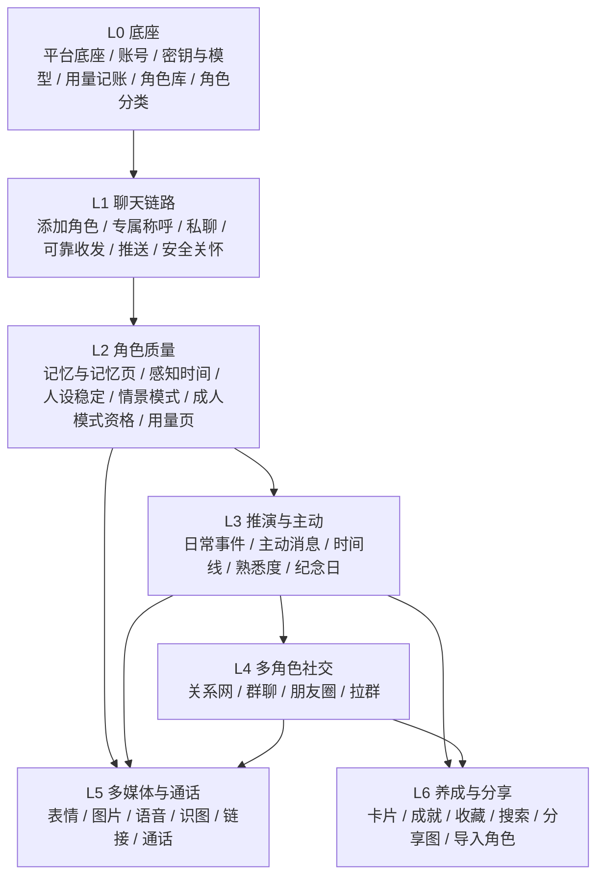

# 微伴 PRD v1.1（完整产品需求）

| 项 | 内容 |
|---|---|
| 负责人 | product-lead |
| 任务 | T-003（v1.0）、T-008（v1.1） |
| 版本 | v1.1 |
| 日期 | 2026-10-04 |
| 状态 | **定稿**。第 9 节列出的 3 项仍待总经理答复，答复前按文中写明的默认做法执行 |
| 输入 | `docs/product/input/2026-10-04-manager-feedback.md`（总经理逐条取舍与硬性边界）、`docs/product/input/2026-10-04-pm-rulings.md`（总负责人裁定）、`docs/decisions/ADR-0001-founding-decisions.md`、`docs/decisions/ADR-0002-product-positioning-and-byok.md`、`docs/decisions/ADR-0008-platform-model-call-billing.md`、`docs/architecture/prd-answers.md`、`docs/architecture/dev-plan.md`、`docs/ai/prd-8.2-answers.md`、`docs/ai/cost-estimate.md`、`docs/handoffs/2026-10-04-design-lead-T-006.md`、`docs/handoffs/2026-10-04-architect-T-004.md` |
| 配套 | 术语表 `docs/product/glossary.md`；用户流程 `docs/product/user-flows.md` |
| 文件名说明 | 文件名保留 `prd-v1.md` 和 `prd-v1/` 目录不变（其他负责人的文档都引用这个路径），版本号以本表为准 |

## 阅读指南（给总经理）

- **先看结论**：第 1 节（产品是什么）、第 6 节（不做什么）、第 9 节（还需要您拍板的 3 件事）。
- **想看某个功能怎么做**：第 4 节目录 → 对应章节。每个功能都写了「用户故事」（谁想要什么）、「规则」、「边界情况」（特殊情况怎么办）和「验收标准」（做完以后逐条打勾检查）。
- **所有可调的产品数字**（比如角色每天最多主动找你几次）只在第 5.1 节定义一次，其他地方写「P-03」这样的编号来引用。以后想改数字只改第 5.1 节。
- **由其他负责人定义的数字**（比如后台预算默认每天几元、导入最多多少字、评测通过线）不在 PRD 里重复写，第 5.2 节告诉你去哪份文档看。
- **本文档不分期**（ADR-0002 第 5 条）：所有功能都要做，第 7 节只是「先做哪个后做哪个」的开发顺序。
- v1.1 相比 v1.0 改了什么，见第 10 节修订记录；各章开头也有一行「v1.1 变更」。

---

## 1. 产品概述

### 1.1 一句话

**微伴：像加上了自己爱豆的微信。**

TA 会回你的消息、记得你说过的话、有自己的日常、会主动找你、发朋友圈、和 TA 的朋友们互动、偶尔给你打个电话。

### 1.2 定位

- 实际使用范围：总经理个人测试；设计标准：按成熟产品设计（ADR-0002 第 1 条）。
- 不做面向公众的合规功能（AI 身份提示、时长提醒、备案、实名、未成年人模式），见 ADR-0002 第 2 条和第 6 节不做清单。
- 模型费用由用户自付（BYOK），用户自选模型（ADR-0002 第 3、4 条）。推演、朋友圈、记忆整理等后台功能的费用也记在用户自己的密钥上，用量页单独列出；管理员侧任务（角色蒸馏、评测、公开动态候选搜索）记在平台密钥上（ADR-0008，已采纳）。

### 1.3 目标用户画像：追星女孩

| 维度 | 描述 |
|---|---|
| 是谁 | 18–30 岁的年轻女性，有一个或几个喜欢的明星或虚拟角色（爱豆） |
| 现在怎么追星 | 刷微博、小红书、超话；看综艺和直播；可能订阅过 Bubble 类付费私信；会收藏爱豆语录、截图分享 |
| 想要什么 | 「被爱豆看见」的感觉：TA 叫我的名字、记得我、主动找我、跟我分享日常；能看到 TA 和 TA 朋友们的互动；有纪念感（认识多少天、收集卡片）；能晒给姐妹看 |
| 讨厌什么 | 角色失忆、变脸、消息被吞；千篇一律的模板回复；聊着聊着被强行恋爱；被冷冰冰的官方提示打断沉浸感；付费抽卡 |
| 使用场景 | 通勤、午休、睡前碎片时间聊几句；深夜情绪需要陪伴；爱豆有新动态时想和「TA」聊聊；节日和纪念日 |
| 技术能力 | 不懂技术，需要模型选择有引导（MDL-03）；会截图、会分享 |

### 1.4 核心体验（按重要程度）

1. **消息不丢、角色不失忆、人设不变脸**（同行差评最集中的三件事，见竞品报告第 7 节）。
2. **像真人的节奏和小细节**：可选的不秒回、拆条、正在输入、已读不回等人设小巧思。
3. **角色有自己的生活**：推演日常 → 主动消息、朋友圈、你不在时的时间线。
4. **角色有自己的圈子**：现实中认识的角色在群聊、朋友圈、私聊中互动，还会拉你进群。
5. **看得见的陪伴进度**：认识第 N 天、熟悉度、卡片、成就——不强制恋爱化。

## 2. 产品原则

所有需求在冲突时按以下原则取舍（编号越小越优先）：

1. **硬性边界不可绕过**：第 10 章优先于一切，用户设置无法绕过。
2. **消息可靠优先于功能丰富**：任何功能都不能以丢消息、重复消息为代价。
3. **角色永远在**：用户找角色时角色一定回复（不做作息表 C1、不做忙碌睡觉状态 G4）。所有「延迟」「已读不回」都有上限。
4. **像真人，不像产品**：不弹官方系统提示打断沉浸（工具故障除外，如 MDL-04）；安全关怀以角色口吻进行（SAFE-06）；发出的消息不能重来（不做 G13）。
5. **不强制恋爱化**：关系由用户决定；熟悉度和恋爱无关（GRW）。
6. **不操纵**：不制造愧疚、不挽留、不设连续打卡惩罚（SAFE-08）；也不用成就、卡片去鼓励用户多花模型费用。
7. **质感优先于频率**：主动消息、朋友圈都有上限，宁少勿滥（参考 Bubble 的「不频繁但有温度」）。
8. **基础功能尽量与微信对齐**（总经理原则），但**分享图不模仿微信界面**（EXP-02，防止被当成本人真实截图）。
9. **一个事实只有一个来源**：推演的日常事件是角色生活的「底稿」，主动消息、朋友圈、时间线、私聊都与之一致。

## 3. 平台与能力边界

依据 ADR-0001 第 1 条及其代价。

| 能力 | 安卓原生 App | iPhone 网页版（PWA） | 需求 |
|---|---|---|---|
| 聊天、群聊、朋友圈、养成 | 完整 | 完整 | — |
| 推送 | 原生推送，尽力保活 | 需 iOS 16.4+ 且添加到主屏幕；不满足时打开 App 才看到 | CHAT-10、ACC-05 |
| 语音通话（用户拨打） | 支持 | **待 Android / Web 负责人评估**（尚未派发评估任务），不可行则显示说明 | MED-06 |
| 主动来电响铃 | 全屏来电 | 不能响铃，改为推送「想和你通话」 | MED-07 |
| 唤起音乐 / 视频 App | 支持（支持哪些平台待 Android 负责人记录） | 依赖系统，尽力而为 | MED-05 |
| 保存分享图到相册 | 支持 | 需 Web 负责人验证；不行则改为「全屏展示 + 长按保存」（`docs/design/share-templates.md` 第 5 节） | EXP-01 |

## 4. 文档目录与需求编号

### 4.1 章节目录

| 章 | 文件 | 编号前缀 | 内容 |
|---|---|---|---|
| 1 | `prd-v1/01-account-settings.md` | ACC | 账号、我的资料、全局通知与免打扰、首次引导、iPhone 主屏幕引导、注销 |
| 2 | `prd-v1/02-model-byok.md` | MDL | 填写密钥、选择模型、排行榜、密钥失效体验、用量与后台预算、换模型提醒 |
| 3 | `prd-v1/03-characters.md` | CHR | 角色广场、资料页、添加角色、名片推荐、通讯录、删除、自定义角色、导入聊天记录、补充设定、人设更新、角色需要具备的信息 |
| 4 | `prd-v1/04-chat.md` | CHAT | 会话列表、消息操作、可靠收发、秒回、拆条、正在输入、已读不回、撤回与打错字、人设贴合度、推送、收藏、搜索、会话设置、人设稳定 |
| 5 | `prd-v1/05-memory.md` | MEM | 近期上下文、关于你的事、记忆页、共同经历与约定、长聊天不失忆、公开资料、跨角色共享 |
| 6 | `prd-v1/06-simulation-proactive.md` | SIM | 推演日常、近期主线、公开动态、感知时间、主动消息总规则、分享日常、事后跟进、久未联系、节日祝福、开关、你不在时 / 时间线、心情、推演花费控制 |
| 7 | `prd-v1/07-social.md` | SOC | 关系网、私聊提起其他角色、群聊、发言调度、群里自己聊、角色拉群、朋友圈 |
| 8 | `prd-v1/08-media-call.md` | MED | 表情包、角色发图、语音消息、识图与联网搜索、分享链接、语音通话、主动来电 |
| 9 | `prd-v1/09-relationship-growth.md` | GRW | 专属称呼与粉丝名、关系类型、熟悉度、认识天数与纪念日、卡片、成就（含首批成就清单） |
| 10 | `prd-v1/10-hard-boundaries.md` | SAFE | **硬性边界专章**：角色分类（含历史人物子类）、真人肖像声音、虚假公开言论、成人模式资格、识图认人范围、儿童角色保护、安全关怀、内容隔离、不操纵 |
| 11 | `prd-v1/11-scenario-modes.md` | MODE | 情景模式列表、切换规则、成人模式开启、维护 |
| 12 | `prd-v1/12-share-export.md` | EXP | 分享图生成与模板 |
| 13 | `prd-v1/13-admin.md` | ADM | 角色库与上架、关系网、公开动态审核、素材库、情景模式与排行榜、人设版本 |

需求编号格式：`前缀-两位数字`，如 SIM-05。编号一经发布不复用；删除的需求保留编号并标「已删除」。v1.1 没有删除或新增需求编号。

### 4.2 与总经理意见的对照（覆盖检查）

编号对应 `docs/product/research/realism-feature-list.md`（已被本 PRD 取代，仅作历史参考），取舍以 `docs/product/input/2026-10-04-manager-feedback.md` 为准。

| 原编号 | 总经理决定 | PRD 需求 |
|---|---|---|
| A1 | 要，改形式（不固定早安晚安，结合活跃情境） | SIM-05、SIM-04 |
| A2 | 要 | SIM-07、MEM-04 |
| A3 | 要，并入推演 | SIM-06、SIM-01 |
| A4 | 要，按人设和熟悉度表现不同 | SIM-08、SAFE-08 |
| A5 | 要 | SIM-10、ACC-03、CHAT-13 |
| A6 | 要 | SIM-09 |
| A7 | 要 | MED-07 |
| B1–B6 | 全部要 | MEM-01～MEM-06 |
| B7 | 要，必须有规则 | MEM-07 |
| C1 | **不要** | 不做清单 |
| C2 | 要，并入推演 | SIM-01 |
| C3 | **不要** | 不做清单 |
| C4 | 要，时间线 + 结合现实 | SIM-11、SIM-03 |
| C5 | 要，前提是现实中认识 | SOC-01、ADM-02 |
| C6 | 要（必须） | SIM-04 |
| C7 | 交给专业判断 | SIM-03、ADM-03：**做，走管理员审核路线**；自动候选经架构 / AI 评估可行（`docs/architecture/prd-answers.md` 第 7 节） |
| C8 | 交给产品判断 | SIM-02：不做独立剧情线，改为「近期主线」；AI 评估可行（`docs/ai/runtime-overview.md` 6.1） |
| C9 | 推演的本质 | 第 6 章总览、SIM-01、SIM-13 |
| D1 | 要 | CHR-05、CHAT-01 |
| D2 | 要 | SOC-03、SOC-04 |
| D3 | 要 | SOC-04、SOC-05 |
| D4 | 要 | SOC-02 |
| D5 | 要 | SOC-06 |
| E1 | 要 | MED-01 |
| E2 | 要 | SOC-07、SOC-08、SOC-09 |
| E3 | 要，不用真人肖像 | MED-02、SAFE-01（历史人物、虚构角色的形象规则见总负责人裁定） |
| E4 | 要，不用真人声音 | MED-03、SAFE-01 |
| E5 | 要（关键） | MED-04、SAFE-04 |
| E6 | 要 | MED-05 |
| E7 | 语音通话要，视频不做 | MED-06；视频见不做清单 |
| E8 | 要（卡片 + 养成 + 成就） | GRW-03、GRW-05、GRW-06（「好感度」以熟悉度实现，总负责人裁定 9.1 第 4 条） |
| F1 | 要，双向 | GRW-01 |
| F2 | 要，与纪念日、卡片融合 | GRW-04、GRW-05 |
| F3 | 要，更自由 | GRW-02 |
| F4 | 要，改为熟悉度 | GRW-03 |
| F5 | 要，必须有事件原因 | SIM-12 |
| F6 | 要，用户可调 | CHAT-09 |
| F7 | 要，角色口吻 | SAFE-06 |
| G1 | 要，开关 | CHAT-04 |
| G2 | 要，开关 | CHAT-05 |
| G3 | 要 | CHAT-06 |
| G4 | **不要** | 不做清单 |
| G5 | 要，人设小巧思 | CHAT-07 |
| G6 | 要，人设小巧思 | CHAT-08 |
| G7 | 要 | CHAT-03 |
| G8 | 要，尽量做好 | CHAT-10、ACC-05 |
| G9 | 要 | CHAT-14、MDL-06、ADM-06 |
| G10 | 改需求：导入 + 分享图 | CHR-08、CHR-09、EXP-01、EXP-02 |
| G11 | 要 | CHAT-11 |
| G12 | **不要** | 不做清单 |
| G13 | **不要** | 不做清单 |
| 原则 | 基础功能与微信对齐 | CHAT-01、CHAT-02、CHAT-12、CHAT-13、CHR-05、SOC-03 |
| 新增 1 | 情景模式 | MODE-01～MODE-04、SAFE-03 |
| 新增 2 | 模型选择 | MDL-01～MDL-06 |
| 角色来源 | 预设 + 自定义；人设持续更新；加角色流程 | CHR-01～CHR-11、ADM-01、ADM-06 |
| 硬性边界 | 总负责人设定 | SAFE-01～SAFE-05、SAFE-07 |

## 5. 参数

### 5.1 产品参数表（全文唯一定义处）

> 这些数字是产品负责人定义的**默认值**，可在不改需求逻辑的情况下调整。修改请更新本表并在修订记录中注明。

| 编号 | 参数 | 默认值 | 用于 |
|---|---|---|---|
| P-01 | 关闭秒回时的回复延迟 | 按回复长度 3–20 秒；从用户消息送达到第一条气泡出现，**最长 60 秒**（含模型生成时间） | CHAT-04 |
| P-02 | 拆条 | 一次回复 1–4 条气泡，气泡间隔 1–4 秒 | CHAT-05 |
| P-03 | 每个角色每天主动消息上限 | 3 次（一次可含多条气泡） | SIM-05 |
| P-04 | 所有角色合计每天主动消息上限 | 8 次 | SIM-05 |
| P-05 | 活跃时段数据不足时的默认可发时段 | 09:00–23:00（用户时区） | SIM-05 |
| P-06 | 活跃时段学习 | 看最近 14 天；至少 5 天有聊天记录才启用 | SIM-05 |
| P-07 | 主动消息话题去重窗口 | 7 天 | SIM-05 |
| P-08 | 久未联系阈值 | 72 小时；每次缺席最多 1 条 | SIM-08 |
| P-09 | 用户正在聊天时，其他角色主动消息延后 | 用户 5 分钟内在任一会话发过消息则延后；最长延后 60 分钟，超时放弃 | SIM-05 |
| P-10 | 主动来电 | 每角色每 7 天最多 1 次；全部角色每 7 天最多 3 次；要求熟悉度 L3 及以上 | MED-07 |
| P-11 | 已读不回 | 每角色每天最多 1 次；延迟 30 秒–3 分钟后必须回复 | CHAT-07 |
| P-12 | 撤回重发 | 每角色每天最多 1 次 | CHAT-08 |
| P-13 | 打错字更正 | 每角色每天最多 2 次 | CHAT-08 |
| P-14 | 负面心情 | 每角色每 7 天最多 2 天；单次最长 24 小时 | SIM-12 |
| P-15 | 推演日常事件数 | 每角色每天 3–6 件（AI 成本评估确认无需调整，`docs/ai/cost-estimate.md` 第 0 节） | SIM-01 |
| P-16 | 朋友圈频率 | 每角色每天最多 1 条；默认每周 2–4 条，按人设调整（AI 成本评估确认无需调整，同上） | SOC-07 |
| P-17 | 长期不活跃暂停推演 | 用户连续 7 天未打开 App | SIM-01 |
| P-18 | 「你不在时」摘要 | 距上次进入该私聊 ≥ 12 小时且期间有日常事件；最多 5 条 | SIM-11 |
| P-19 | 群聊回应 | 每条用户消息后最多 3 个角色回应；无用户新发言时角色连续消息最多 6 条 | SOC-04 |
| P-20 | 群聊自发话题 | 每群每天最多 1 次，每次最多 10 条消息；仅限 7 天内用户发过言的群 | SOC-05 |
| P-21 | 群成员上限 | 9 个角色 + 用户 | SOC-03 |
| P-22 | 角色主动拉群 | 全部角色合计每 7 天最多 1 次 | SOC-06 |
| P-23 | 用户撤回自己消息的时限 | 2 分钟（与微信一致） | CHAT-02 |
| P-24 | 单张分享图消息数上限 | 30 条 | EXP-01 |
| P-25 | 熟悉度 | 升级累计点数：L2 = 30、L3 = 100、L4 = 300、L5 = 700；每角色每天最多获得 20 点；有效聊天日 +10、回复主动消息 +2、朋友圈互动 +2、纪念日当天聊天 +10、首次完成某互动 +5（按现值，最快 35 天到 L5，经常聊天约 2 个月） | GRW-03 |
| P-26 | 通讯录角色数上限 | 50 个 | CHR-03、SIM-13 |
| P-27 | 名片推荐 | 所有角色合计每 7 天最多主动推荐 1 次；「不感兴趣」后该角色冷却 90 天 | CHR-04 |
| P-28 | 开启秒回时 | 不加人为延迟；每条气泡前「正在输入」至少显示 1 秒 | CHAT-04 |
| P-29 | 朋友圈回复时限 | 角色回复用户评论、点赞或评论用户动态，最晚 2 小时内 | SOC-08、SOC-09 |
| P-30 | 添加角色后「通过好友申请」的时间 | 3–30 秒（随机） | CHR-03 |
| P-31 | 单次语音通话时长上限 | 60 分钟；到 55 分钟时角色自然提醒（v1.1 从 MED-06 正文移入本表；AI 成本评估确认维持，`docs/ai/cost-estimate.md` 第 5 节） | MED-06 |

### 5.2 由其他负责人定义的数字（PRD 只引用，不在此重复）

> 这些数字的「唯一定义处」在右列文档里。要改，请找对应负责人改那份文档；PRD 正文只写「见某文档」。

| 内容 | 唯一定义处 | 负责人 | PRD 中用到的地方 |
|---|---|---|---|
| 后台功能每天预算的默认值；达到预算后停止哪些功能、哪些延后、哪些不停 | `docs/ai/cost-estimate.md` 第 6 节 | AI | MDL-05、SIM-13 |
| 各功能的估算费用（含语音通话每分钟费用、导入一次的费用档位） | `docs/ai/cost-estimate.md` 第 0、5 节 | AI | CHR-08、MED-06 |
| 用量估算方法 | `docs/ai/cost-estimate.md` 第 7 节 | AI | MDL-05 |
| 导入聊天记录单次文字上限 | `docs/ai/runtime-overview.md` 第 12 节第 6 条 | AI | CHR-08 |
| 聊天截图导入单次张数上限 | `docs/ai/runtime-overview.md` 第 12 节第 7 条 | AI | CHR-08 |
| 供应商列表、模型能力标签、价格档位 | `docs/ai/model-catalog.md` | AI | MDL-01、MDL-02、MDL-03 |
| 所有「评测集覆盖」验收项的题量与通过线 | `docs/ai/eval-plan.md` 第 2 节 | AI | 全文 |
| 人设稳定检查的方法与通过线 | `docs/ai/eval-plan.md` 第 4 节 | AI | CHAT-14、ADM-06、CHR-10 |
| 识图认人准确率通过线（暂定，实测后修订） | `docs/ai/eval-plan.md` 2.2 节、`docs/ai/runtime-overview.md` 8.3 节 | AI | MED-04、SAFE-04 |
| 成人模式中法律禁止的内容清单 | `docs/ai/prd-8.2-answers.md` 第 10 问补充 | AI | MODE-03、SAFE-03 |
| 模型故障的重试次数与间隔 | `docs/architecture/message-reliability.md` 第 6 节 | 架构 | MDL-04 |
| 「5 秒多端同步」「10 秒推送」的验收条件与测法 | `docs/architecture/message-reliability.md` 第 9 节 | 架构 | ACC-01、CHAT-10 |
| 公开动态自动候选的频率、范围、每次条数 | `docs/architecture/prd-answers.md` 第 7 节 | 架构 | SIM-03、ADM-03 |
| 分享图尺寸、字号、标注样式 | `docs/design/share-templates.md` | 设计 | EXP-01、EXP-02 |

## 6. 不做清单

| 不做的功能 | 原编号 | 理由 |
|---|---|---|
| 角色作息表 | C1 | 总经理：角色不是真人，用户找角色时不能在睡觉不回 |
| 角色日记 | C3 | 总经理：明星更适合发朋友圈（E2） |
| 忙碌 / 睡觉状态 | G4 | 总经理：用户找角色时角色必须在 |
| AI 身份提示、使用时长提醒 | G12 | 总经理决定；个人测试不实现面向公众的合规功能（ADR-0002 第 2 条） |
| 重新生成 / 编辑角色回复（「刷卡」） | G13 | 总经理：不真人 |
| 视频通话 | E7 | 总经理：成本太高，还要做角色形象 |
| 群语音通话 | — | 视频不做、语音单聊已足够；成本高 |
| 生成真人本人的肖像、克隆真人声音 | E3、E4 | 硬性边界（SAFE-01）；历史人物的古风插画形象是总负责人裁定的例外，见 SAFE-01 |
| 针对任意人的人脸识别；建立人脸特征库 | E5 | 硬性边界（SAFE-04）；AI 方案不建人脸库（`docs/ai/runtime-overview.md` 8.1） |
| 真人角色、儿童角色的成人模式 | 新增 1 | 硬性边界（SAFE-03） |
| **任何绕过模型供应商内容审核的办法**（越狱提示词、规避审核的改写等） | 新增 1 | 总负责人决定（T-008）：成人模式只在供应商协议允许的模型上可用（MODE-03） |
| 群聊中的情景模式（含成人模式） | — | 避免一个人的设定影响全群；成人内容只在私聊 |
| 抽卡、付费、会员、充值 | E8 | 个人测试不做支付（ADR-0001 第 4 条）；竞品「付费过度」是主要差评 |
| 连续打卡、断签清零 | E8 | 与「不操纵」原则冲突（SAFE-08） |
| 红包、转账 | — | 不做支付；与微信对齐只对齐聊天基础功能 |
| 自定义角色公开分享、角色社区 / 市场 | — | 个人测试；公开分发涉及版权和人格权（竞品报告第 8 节第 2、3 条） |
| 多个真实用户之间互相聊天、互看朋友圈 | — | 微伴是「你和角色的微信」，不是真人社交网络 |
| 聊天记录完整备份导出（文本 / 文件） | 原 G10 | 总经理已把 G10 改为「导入 + 分享图」；如需要可后续单独提出 |
| 直接解析微信的加密聊天数据 | 原 G10 | 架构评估：微信没有官方明文导出，解析加密数据库维护成本高且涉及他人隐私；用户用第三方工具导出成文本后按 .txt / .csv 导入（`docs/architecture/prd-answers.md` 第 6 节） |
| 仿微信界面（绿色气泡、手机状态栏）的分享图 | G10 ② | 容易被当成明星本人的真实聊天截图（SAFE-02），也不宜照搬他人产品界面；改为还原微伴自己的界面（EXP-02） |
| 从声音本身判断用户情绪 | E4 | AI 评估 v1 不承诺；只从语音转出的文字判断情绪（MED-03） |
| 无人审核的明星新闻自动同步 | C7 | 防止角色把谣言当事实说出（SAFE-02）；改为管理员审核路线（SIM-03） |
| 独立的长期剧情线系统 | C8 | 与明星人设不搭；改为轻量「近期主线」（SIM-02） |
| 复杂世界模拟（AI 小镇式全量实时推演） | C9 | 总经理：不做复杂模拟；成本高 |
| 公众号、小程序、视频号、直播 | — | 超出「爱豆的微信聊天」核心体验 |
| 实名、备案、未成年人模式；手机号 / 邮箱 / 第三方账号登录 | — | ADR-0001 第 4 条、ADR-0002 第 2 条；登录方式见 ACC-01 |

## 7. 开发依赖顺序

> 这不是分批上线，只是内部开发顺序（ADR-0002 第 5 条）。每完成一层都能在本机试用。
> v1.1 已按架构负责人的评审建议（`docs/architecture/prd-answers.md` 第 8 节）修订，与 `docs/architecture/dev-plan.md` 的层次一致。**具体任务拆分、负责人和排期以 dev-plan 为准**，本节只说明「每层做完能试用什么、包含哪些需求」。

### 7.1 分层表

| 层 | 目标（完成后能试用什么） | 包含的需求 | 依赖 |
|---|---|---|---|
| L0 底座 | 能登录、能填密钥调通模型、后台能建一个预设角色 | **平台底座**（不对应 PRD 编号，但所有功能都依赖：仓库骨架、CI、开发与生产环境、事件发件箱、任务队列、日志脱敏、用量记账、注销删除清单接口）；ACC-01、ACC-02、MDL-01、MDL-02、MDL-04（故障分类、重试与横条组件）、MDL-05 的**用量记录**（每次模型调用都记账，页面在 L2）、ADM-01（最小可用）、CHR-11（角色资料结构）、第 10 章 10.0 角色分类 | 无 |
| L1 聊天链路 | 加一个角色，和 TA 稳定地私聊，收到推送 | CHR-01、CHR-02、CHR-03、CHR-05、CHR-06、**GRW-01**（从 L2 提前）、CHAT-01、CHAT-02（文字、表情、引用、拍一拍；图片、语音、链接随 L5）、CHAT-03～CHAT-06、CHAT-10、CHAT-13（通用部分）、ACC-03、ACC-04、ACC-05、MDL-04（合并补回复）、SAFE-06（安全关怀从第一天就要有）、SAFE-01（默认头像非肖像部分；图片与声音部分随 L5）、SAFE-02、SAFE-07 的**数据基础**（消息内容范围标记，规则在 L2 验收） | L0 |
| L2 角色质量 | TA 记得我、像 TA、可以切模式 | MEM-01、MEM-02、**MEM-03**（从 L3 提前）、MEM-05、MEM-06、**SIM-04**（从 L3 提前）、CHAT-07、CHAT-08、CHAT-09、CHAT-14、GRW-02、MODE-01～MODE-04、SAFE-03、SAFE-05、SAFE-07、MDL-03、MDL-05（用量页与后台预算）、MDL-06、CHR-07、CHR-10（人设版本部分）、ADM-05、ADM-06 | L1 |
| L3 推演与主动 | TA 有自己的日常，会主动找我，会想念我 | SIM-01 → SIM-02、SIM-03（含 ADM-03）→ SIM-05～SIM-10、SIM-12、SIM-11、SIM-13；MEM-04；GRW-03、GRW-04（主动消息和来电依赖熟悉度和纪念日）；SAFE-08；ADM-04 中的节日清单 | L2 |
| L4 多角色社交 | TA 有自己的圈子：群聊、朋友圈、拉群 | SOC-01（含 ADM-02）→ SOC-02、MEM-07、CHR-04 → SOC-03、SOC-04、SOC-05 → SOC-07、SOC-08、SOC-09 → SOC-06 | L3（日常事件是群聊话题和朋友圈的来源） |
| L5 多媒体与通话 | 发图、语音、认出杂志图、分享歌、打电话 | ADM-04（表情包、音色、卡面模板）、MED-01、MED-02、MED-03、MED-04（含 SAFE-04）、MED-05、MED-06、MED-07；SAFE-01 的图片与声音部分 | MED-01、MED-03、MED-06 只依赖 L2，可与 L3、L4 并行；MED-02 依赖 L3/L4（日常配图、朋友圈配图）；MED-04 依赖 SOC-01（认人名单）；MED-07 依赖 GRW-03 |
| L6 养成与分享 | 卡册、成就、收藏、搜索、分享图、导入角色 | GRW-05、GRW-06、CHAT-11、CHAT-12、EXP-01、EXP-02、CHR-08（截图导入放在本层最后）、CHR-09、CHR-10（「资料已更新」提示部分）、ACC-06（完整注销流程与验证） | L3（卡片依赖纪念日和熟悉度）；EXP 依赖 CHAT-11 |

说明：
- 每一层内部：契约先行（架构），然后后端、网页、安卓三条线可并行；安卓壳从 L1 开始与网页并行（dev-plan 第 0 节）。
- 管理后台随各层同步做最小可用部分：L0 角色库、L2 情景模式与人设版本、L3 公开动态与节日清单、L4 关系网、L5 素材库。
- SOC-09（用户发朋友圈）中「角色评论用户的图片」依赖 MED-04 识图；在 MED-04 完成前，先只支持文字动态的互动。
- 跨层的需求按「哪一层能完整验收」放置，其中一部分功能会提前或推后落地，验收时按下表处理：

| 需求 | 在哪层验收 | 说明 |
|---|---|---|
| CHR-03 第 5 条（首次进入私聊时「想和 TA 是什么关系？」提示） | L2（随 GRW-02） | L1 先保存默认关系类型，提示和设置入口在 L2 |
| CHR-06 第 2 条（删除角色后退出其所在群聊） | L4（随 SOC-03） | L1 时还没有群聊 |
| SAFE-06 第 5 条（群聊中触发时转私聊跟进） | L4（随 SOC-03） | 私聊和语音通话部分分别在 L1、L5 验收 |
| CHR-04（名片推荐） | L4 | v1.0 同时出现在 L1 和 L4，v1.1 只保留在 L4（依赖关系网） |

### 7.2 依赖关系图

（L2 → L5 的箭头表示 MED-01、MED-03、MED-06 可在 L2 完成后先做；其余 MED 需求仍依赖 L3、L4。）

### 7.3 与 dev-plan 的一致性核对

- 架构建议的 6 处调整（`prd-answers.md` 第 8 节）已全部采纳：L0 增加平台底座；SIM-04 提前到 L2；GRW-01 提前到 L1；MEM-03 提前到 L2；SAFE-07 数据基础在 L1；MDL-05 用量记录在 L0。
- **产品对 dev-plan 没有异议。** 只有一处请架构负责人顺手对齐措辞（不影响排期）：dev-plan D-L1-03 写的是「CHR-01～CHR-06」，按上表 CHR-04 在 L4 的 D-L4-02 完成，建议改为「CHR-01～03、CHR-05、CHR-06」。

## 8. 其他负责人的答复（v1.0 提出的问题，v1.1 已关闭）

> v1.0 第 8 节向各负责人提出的问题，答复后已并入各章正文。下表只做索引，细节以右列文档为准。仍未答复的问题见 8.4。

### 8.1 架构负责人（9 问，全部答复，汇总见 `docs/architecture/prd-answers.md`）

| # | 问题 | 结论 | 并入 |
|---|---|---|---|
| 1 | 登录方式 | 用户名 + 密码，注册需要邀请码 | ACC-01 |
| 2 | 消息可靠与多端同步；5 秒、10 秒是否合理 | 合理；10 秒推送需带条件验收 | ACC-01、CHAT-03、CHAT-10 |
| 3 | 密钥加密、日志脱敏、注销删除及验证 | 已给方案与验证方法 | MDL-01、ACC-06 |
| 4 | 平台调用模型的费用归属 | 用户世界里的调用记用户密钥，管理员侧任务记平台密钥（ADR-0008 已采纳） | 1.2、MDL-05 |
| 5 | 管理后台形态与权限 | 独立网页、独立子域名、独立管理会话 | 第 13 章 |
| 6 | 导入格式与原文删除 | 粘贴、.txt、.csv；不直接解析微信；支持截图导入（张数上限见 5.2），放 L6 最后；原文默认生成后删除 | CHR-08 |
| 7 | 公开动态自动候选 | 可行；每角色每周一次、必须管理员审核 | SIM-03、ADM-03 |
| 8 | 开发顺序 | 总体正确，6 处调整 | 第 7 节 |
| 9 | 系统层面执行硬性边界 | 四道闸（ADR-0007） | 第 10 章 |

### 8.2 AI 系统负责人（15 问，全部答复，汇总见 `docs/ai/prd-8.2-answers.md`）

| # | 问题 | 结论 | 并入 |
|---|---|---|---|
| 1 | 角色卡能否覆盖 CHR-11 | 全部覆盖（角色卡格式 ADR-0009 为「提议」状态，待架构在 D-L0-10 评审） | CHR-11 |
| 2 | 供应商、默认推荐、排行榜来源 | 6 家国内供应商 + 自定义兼容地址；排行榜以微伴自测为主 | MDL-01～03 |
| 3 | 用量估算、后台预算默认值 | 已定义 | MDL-05 |
| 4 | 推演实现与成本；P-15、P-16 | 不需调整 | SIM-01、P-15、P-16 |
| 5 | 近期主线可行性 | 可行 | SIM-02 |
| 6 | 群聊发言调度 | 规则 + 抽签，不额外调用模型 | SOC-04 |
| 7 | 记忆提取、跨角色共享类别识别 | 不确定时一律按永不共享 | MEM-02、MEM-05、MEM-07 |
| 8 | 识图认人 | 封闭名单判断、不建人脸库；通过线暂定 | MED-04、SAFE-04 |
| 9 | 安全关怀识别与评测集 | 两级识别；评测 32 条 | SAFE-06 |
| 10 | 成人模式法律禁止内容；儿童特征检测 | 已定义禁止清单；检测不确定按「是儿童」处理 | MODE-03、SAFE-03 |
| 11 | 人设稳定检查 | 已定义方法与通过线 | CHAT-14、ADM-06 |
| 12 | 图片、语音服务；是否 BYOK；通话时长 | 全部走 BYOK；通话用级联方案；60 分钟维持 | MDL-02、MED-02、MED-03、MED-06、P-31 |
| 13 | 导入上限与「5 万字 3 分钟」 | 可行；单次有上限 | CHR-08 |
| 14 | 名场面识别 | 可行，几乎零成本 | GRW-05 |
| 15 | 评测集覆盖 | 已覆盖全部标注项 | 全文 |

### 8.3 设计负责人（5 问，全部答复，见 `docs/design/` 与 `docs/handoffs/2026-10-04-design-lead-T-006.md`）

| # | 问题 | 结论 | 并入 |
|---|---|---|---|
| 1 | 全部界面与交互 | 设计体系 v1.0 与 11 份页面说明 | 全文 |
| 2 | 真人非肖像默认头像 | `docs/design/default-avatar.md` | SAFE-01 |
| 3 | 分享图 4 套模板与标注 | `docs/design/share-templates.md`；「微信原样」改为「聊天原样」 | EXP-01、EXP-02 |
| 4 | 卡面、卡册、熟悉度、成就页；首批成就 | `docs/design/pages/cards-familiarity.md`；成就清单在 GRW-06 定稿 | GRW-03～06 |
| 5 | 你不在时、时间线、系统横条、情景模式标识 | 已在页面说明中覆盖 | SIM-11、MDL-04、MODE-01 |

### 8.4 仍未答复（Android 负责人 / Web 负责人，尚未派发评估任务）

| # | 问题 | 涉及需求 | 答复前的默认做法 |
|---|---|---|---|
| 1 | iPhone 网页版能否做用户拨打的语音通话 | MED-06 | 按「不支持」准备说明文字 |
| 2 | 安卓后台推送送达率与国内厂商限制 | CHAT-10 | 验收条件按 `message-reliability.md` 第 9 节 |
| 3 | 安卓唤起音乐 / 视频 App 支持哪些平台 | MED-05 | 不能唤起的一律用浏览器打开 |
| 4 | 安卓全屏来电与 iPhone 替代体验 | MED-07 | 按 MED-07 第 4、6 条 |
| 5 | 分享图保存到相册（两端） | EXP-01 | iPhone 不行时改为「全屏展示 + 长按保存」 |

### 8.5 质量负责人

- 按各章验收标准制定测试方法；标注「评测集覆盖」的项用 AI 的评测集（`docs/ai/eval-plan.md`），通过线以该文为准。
- 重点：消息可靠（CHAT-03，方法见 `message-reliability.md` 第 10 节）、失忆（MEM）、变脸（CHAT-14）、硬性边界（第 10 章，绕过测试清单见 `docs/architecture/hard-boundaries.md` 第 5 节）、密钥泄露与注销删除（`docs/architecture/security-and-privacy.md` 第 6 节）。
- 「两个测试账号核对」类验收（CHR-09）需要准备第二个测试账号（注册需要邀请码）。

## 9. 冲突上报与待决定事项

> 产品负责人**不选边**，以下由项目总负责人处理或转交总经理。

### 9.1 v1.0 上报事项的处理结果（已关闭）

| v1.0 编号 | 事项 | 处理结果 | 依据 |
|---|---|---|---|
| 9.1-1、2 | `docs/status.md` 过时 | 总负责人已更新 | `input/2026-10-04-pm-rulings.md` 9.1 |
| 9.1-3 | 调研文件被总经理意见替代 | 两份调研文件头部已加注「已被 PRD v1.0 取代，仅作历史参考」 | 同上 |
| 9.1-4 | 好感度 / 熟悉度用词 | 统一为「熟悉度」 | 同上 |
| 9.2-1 | 历史人物是否算真人 | 是，单列「历史人物」子类；允许古风插画形象 | 同上 9.2 第 1 条；正文 SAFE 10.0、SAFE-01 |
| 9.2-2 | 儿童角色额外禁止恋爱 | 确认，SAFE-05 原样采纳 | 同上 9.2 第 2 条 |
| 9.2-3 | 虚构角色形象图片 | 允许，仅限个人测试，分享图加注 | 同上 9.2 第 3 条；正文 MED-02、EXP-01 |
| 9.3-3 | 「基于真人」的自定义角色是否同真人明星处理 | 是（总负责人裁定，不再提交总经理） | 同上 9.3 第 3 条；正文 SAFE-01 |
| 9.3-4 | 虚构角色形象（总经理层面） | 已由总负责人裁定 | 同上 9.3 第 4 条 |
| — | 语音通话费用提示是否显示 | 首次发起通话前和设置页显示，通话界面内不显示 | 总负责人决定（T-008 任务卡）；正文 MED-06 |
| — | 「删除消息」是否在本人所有设备同步删除 | 是，产品确认这种理解正确 | 架构 T-004 交接；正文 CHAT-02 |

### 9.2 仍待总经理决定（答复前按默认做法执行）

| # | 问题 | 默认做法（产品建议） | 理由 | 正文位置 |
|---|---|---|---|---|
| 1 | 预设真人角色的默认头像能否用本人公开照片 | **不用**；用名字首字或应援色的非肖像设计（`docs/design/default-avatar.md`），用户可上传自己的图片作头像（只对自己可见）；历史人物可用古风插画 | 与「不生成本人肖像」的精神一致，风险最低；如果允许，设计已留退路（头像组件优先显示图片） | SAFE-01 第 5 条 |
| 2 | 含真人角色内容的分享图，是否强制带「非本人」标注 | **强制** | 分享图会离开微伴被传播，没有标注可能被当成明星真实聊天截图；如果不强制，去掉标注文字即可，「微伴」标识保留 | SAFE-02 第 4 条、EXP-01 第 5 条 |
| 3 | 成人模式是否启用 | PRD 按「启用，但只能用供应商协议允许此类内容的模型」写（MODE-03）。**提示**：AI 负责人说明，国内主流供应商协议普遍禁止此类内容，模型目录中「允许成人内容」标签目前一律不打，所以即使启用，用户也要自己找到协议允许的服务（例如通过「自定义兼容地址」接入并自行声明） | 平台不提供任何绕过审核的办法（不做清单）。如果总经理决定**不启用**：情景模式列表中不显示成人模式即可，资格判定、隔离等代码保留，不影响其他功能 | MODE-03、SAFE-03 |

### 9.3 v1.1 新发现、需要其他负责人确认的事

| # | 事项 | 涉及文档 | 产品建议 |
|---|---|---|---|
| 1 | 后台预算用完后主动消息当天停止（`cost-estimate.md` 第 6 节）。其中 SAFE-06 第 6 条「安全关怀次日跟进」也是一条主动消息，按现规则会被预算拦下 | `docs/ai/cost-estimate.md` 第 6 节 vs PRD SAFE-06 第 6 条 | 建议安全关怀跟进不受后台预算限制（与安全检查「不停」同理，费用极小）。请 AI 负责人确认后改 cost-estimate；确认前 PRD 不改数字定义处 |
| 2 | 自定义兼容地址的模型能否由用户自己声明「允许成人内容」 | `docs/ai/model-catalog.md` 第 1、2 节（自定义地址的能力「用户自己勾选」） | PRD MODE-03 按「可以自行声明，需单独勾选确认」写；请 AI 负责人确认网关的 `adult_content` 判断接受用户声明 |
| 3 | dev-plan D-L1-03 的需求范围措辞 | `docs/architecture/dev-plan.md` | 见 7.3，不影响排期 |

## 10. 修订记录

| 版本 | 日期 | 修改 | 修改人 |
|---|---|---|---|
| v1.0 | 2026-10-04 | 首版，覆盖完整产品范围 | product-lead |
| v1.1 | 2026-10-04 | 吸收总负责人裁定与架构、AI、设计三方答复（T-008）。**主文件**：状态改为定稿；5.1 节 P-15、P-16 去掉「待评估」，新增 P-31（通话时长上限，从 MED-06 移入）；新增 5.2 节「由其他负责人定义的数字」引用表；不做清单新增 4 项（绕过供应商审核、直接解析微信加密数据、仿微信界面的分享图、从声音判断情绪）；第 7 节按架构建议修订（L0 平台底座，SIM-04、MEM-03 提前到 L2，GRW-01 提前到 L1，SAFE-07 数据基础和 MDL-05 用量记录提前，CHR-04 只留在 L4，MED-01/03/06 可在 L2 后并行），新增跨层验收表和与 dev-plan 的核对；第 8 节改为答复索引；第 9 节关闭已裁定事项，保留 3 项待总经理决定，新增 3 项待其他负责人确认。**各章**：ACC-01 登录方式；MDL-01～05 供应商、标签、排行榜来源、重试、预算与费用归属；CHR-08 导入格式与上限；CHR-11 引用角色卡规范；CHAT-02 删除消息多设备同步；CHAT-10 推送验收条件；MEM-07 不确定按永不共享；SIM-02、SIM-03 可行性结论；MED-02 虚构角色与历史人物形象；MED-03 情绪识别范围；MED-04 识图方案与通过线引用；MED-06 级联方案、费用提示、P-31；GRW-05 卡面形象与瞬间卡排除项；**GRW-06 首批 28 个成就定稿**；第 10 章新增历史人物子类、去掉全部「待确认」；MODE-03 成人模式模型要求；EXP-01 虚构角色形象图标注与顶部小标签；EXP-02「微信原样」改为「聊天原样」；ADM 后台形态、蒸馏流程、历史人物标注、成人内容标签。术语表、用户流程同步更新 | product-lead |
