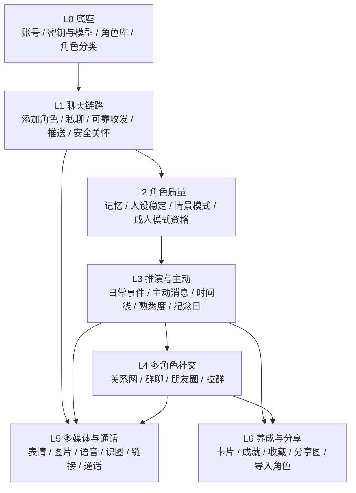

# 微伴 PRD v1.0（完整产品需求）

| 项 | 内容 |
|---|---|
| 负责人 | product-lead |
| 任务 | T-003 |
| 版本 | v1.0 |
| 日期 | 2026-10-04 |
| 状态 | 待总负责人审阅；第 9 节所列事项确认后定稿 |
| 输入 | `docs/product/input/2026-10-04-manager-feedback.md`（总经理逐条取舍与硬性边界）、`docs/decisions/ADR-0002-product-positioning-and-byok.md`、`docs/decisions/ADR-0001-founding-decisions.md`、`docs/product/research/competitive-analysis.md`、`docs/product/research/realism-feature-list.md` |
| 配套 | 术语表 `docs/product/glossary.md`；用户流程 `docs/product/user-flows.md` |

## 阅读指南（给总经理）

- **先看结论**：第 1 节（产品是什么）、第 6 节（不做什么）、第 9 节（需要您和总负责人拍板的事）。
- **想看某个功能怎么做**：第 4 节目录 → 对应章节。每个功能都写了「用户故事」（谁想要什么）、「规则」、「边界情况」（特殊情况怎么办）和「验收标准」（做完以后逐条打勾检查）。
- **所有可调的数字**（比如角色每天最多主动找你几次）只在第 5 节定义一次，其他地方写「P-03」这样的编号来引用。以后想改数字只改第 5 节。
- **本文档不分期**（ADR-0002 第 5 条）：所有功能都要做，第 7 节只是「先做哪个后做哪个」的开发顺序建议。

---

## 1. 产品概述

### 1.1 一句话

**微伴：像加上了自己爱豆的微信。**

TA 会回你的消息、记得你说过的话、有自己的日常、会主动找你、发朋友圈、和 TA 的朋友们互动、偶尔给你打个电话。

### 1.2 定位

- 实际使用范围：总经理个人测试；设计标准：按成熟产品设计（ADR-0002 第 1 条）。
- 不做面向公众的合规功能（AI 身份提示、时长提醒、备案、实名、未成年人模式），见 ADR-0002 第 2 条和第 6 节不做清单。
- 模型费用由用户自付（BYOK），用户自选模型（ADR-0002 第 3、4 条）。

### 1.3 目标用户画像：追星女孩

| 维度 | 描述 |
|---|---|
| 是谁 | 18–30 岁的年轻女性，有一个或几个喜欢的明星或虚拟角色（爱豆） |
| 现在怎么追星 | 刷微博、小红书、超话；看综艺和直播；可能订阅过 Bubble 类付费私信；会收藏爱豆语录、截图分享 |
| 想要什么 | 「被爱豆看见」的感觉：TA 叫我的名字、记得我、主动找我、跟我分享日常；能看到 TA 和 TA 朋友们的互动；有纪念感（认识多少天、收集卡片）；能晒给姐妹看 |
| 讨厌什么 | 角色失忆、变脸、消息被吞；千篇一律的模板回复；聊着聊着被强行恋爱；被冷冰冰的官方提示打断沉浸感；付费抽卡 |
| 使用场景 | 通勤、午休、睡前碎片时间聊几句；深夜情绪需要陪伴；爱豆有新动态时想和「TA」聊聊；节日和纪念日 |
| 技术能力 | 不懂技术，需要模型选择有引导（MDL-03）；会截图、会分享 |

### 1.4 核心体验（按重要程度）

1. **消息不丢、角色不失忆、人设不变脸**（同行差评最集中的三件事，见竞品报告第 7 节）。
2. **像真人的节奏和小细节**：可选的不秒回、拆条、正在输入、已读不回等人设小巧思。
3. **角色有自己的生活**：推演日常 → 主动消息、朋友圈、你不在时的时间线。
4. **角色有自己的圈子**：现实中认识的角色在群聊、朋友圈、私聊中互动，还会拉你进群。
5. **看得见的陪伴进度**：认识第 N 天、熟悉度、卡片、成就——不强制恋爱化。

## 2. 产品原则

所有需求在冲突时按以下原则取舍（编号越小越优先）：

1. **硬性边界不可绕过**：第 10 章优先于一切，用户设置无法绕过。
2. **消息可靠优先于功能丰富**：任何功能都不能以丢消息、重复消息为代价。
3. **角色永远在**：用户找角色时角色一定回复（不做作息表 C1、不做忙碌睡觉状态 G4）。所有「延迟」「已读不回」都有上限。
4. **像真人，不像产品**：不弹官方系统提示打断沉浸（工具故障除外，如 MDL-04）；安全关怀以角色口吻进行（SAFE-06）；发出的消息不能重来（不做 G13）。
5. **不强制恋爱化**：关系由用户决定；熟悉度和恋爱无关（GRW）。
6. **不操纵**：不制造愧疚、不挽留、不设连续打卡惩罚（SAFE-08）。
7. **质感优先于频率**：主动消息、朋友圈都有上限，宁少勿滥（参考 Bubble 的「不频繁但有温度」）。
8. **基础功能尽量与微信对齐**（总经理原则）。
9. **一个事实只有一个来源**：推演的日常事件是角色生活的「底稿」，主动消息、朋友圈、时间线、私聊都与之一致。

## 3. 平台与能力边界

依据 ADR-0001 第 1 条及其代价。

| 能力 | 安卓原生 App | iPhone 网页版（PWA） | 需求 |
|---|---|---|---|
| 聊天、群聊、朋友圈、养成 | 完整 | 完整 | — |
| 推送 | 原生推送，尽力保活 | 需 iOS 16.4+ 且添加到主屏幕；不满足时打开 App 才看到 | CHAT-10、ACC-05 |
| 语音通话（用户拨打） | 支持 | **待 Android / Web 负责人评估**，不可行则显示说明 | MED-06 |
| 主动来电响铃 | 全屏来电 | 不能响铃，改为推送「想和你通话」 | MED-07 |
| 唤起音乐 / 视频 App | 支持 | 依赖系统，尽力而为 | MED-05 |
| 保存分享图到相册 | 支持 | 需验证 | EXP-01 |

## 4. 文档目录与需求编号

### 4.1 章节目录

| 章 | 文件 | 编号前缀 | 内容 |
|---|---|---|---|
| 1 | `prd-v1/01-account-settings.md` | ACC | 账号、我的资料、全局通知与免打扰、首次引导、iPhone 主屏幕引导、注销 |
| 2 | `prd-v1/02-model-byok.md` | MDL | 填写密钥、选择模型、排行榜、密钥失效体验、用量与后台预算、换模型提醒 |
| 3 | `prd-v1/03-characters.md` | CHR | 角色广场、资料页、添加角色、名片推荐、通讯录、删除、自定义角色、导入聊天记录、补充设定、人设更新、角色需要具备的信息 |
| 4 | `prd-v1/04-chat.md` | CHAT | 会话列表、消息操作、可靠收发、秒回、拆条、正在输入、已读不回、撤回与打错字、人设贴合度、推送、收藏、搜索、会话设置、人设稳定 |
| 5 | `prd-v1/05-memory.md` | MEM | 近期上下文、关于你的事、记忆页、共同经历与约定、长聊天不失忆、公开资料、跨角色共享 |
| 6 | `prd-v1/06-simulation-proactive.md` | SIM | 推演日常、近期主线、公开动态、感知时间、主动消息总规则、分享日常、事后跟进、久未联系、节日祝福、开关、你不在时 / 时间线、心情、推演花费控制 |
| 7 | `prd-v1/07-social.md` | SOC | 关系网、私聊提起其他角色、群聊、发言调度、群里自己聊、角色拉群、朋友圈 |
| 8 | `prd-v1/08-media-call.md` | MED | 表情包、角色发图、语音消息、识图与联网搜索、分享链接、语音通话、主动来电 |
| 9 | `prd-v1/09-relationship-growth.md` | GRW | 专属称呼与粉丝名、关系类型、熟悉度、认识天数与纪念日、卡片、成就 |
| 10 | `prd-v1/10-hard-boundaries.md` | SAFE | **硬性边界专章**：真人肖像声音、虚假公开言论、成人模式资格、识图认人范围、儿童角色保护、安全关怀、内容隔离、不操纵 |
| 11 | `prd-v1/11-scenario-modes.md` | MODE | 情景模式列表、切换规则、成人模式开启、维护 |
| 12 | `prd-v1/12-share-export.md` | EXP | 分享图生成与模板 |
| 13 | `prd-v1/13-admin.md` | ADM | 角色库与上架、关系网、公开动态审核、素材库、情景模式与排行榜、人设版本 |

需求编号格式：`前缀-两位数字`，如 SIM-05。编号一经发布不复用；删除的需求保留编号并标「已删除」。

### 4.2 与总经理意见的对照（覆盖检查）

编号对应 `docs/product/research/realism-feature-list.md`，取舍以 `docs/product/input/2026-10-04-manager-feedback.md` 为准。

| 原编号 | 总经理决定 | PRD 需求 |
|---|---|---|
| A1 | 要，改形式（不固定早安晚安，结合活跃情境） | SIM-05、SIM-04 |
| A2 | 要 | SIM-07、MEM-04 |
| A3 | 要，并入推演 | SIM-06、SIM-01 |
| A4 | 要，按人设和熟悉度表现不同 | SIM-08、SAFE-08 |
| A5 | 要 | SIM-10、ACC-03、CHAT-13 |
| A6 | 要 | SIM-09 |
| A7 | 要 | MED-07 |
| B1–B6 | 全部要 | MEM-01～MEM-06 |
| B7 | 要，必须有规则 | MEM-07 |
| C1 | **不要** | 不做清单 |
| C2 | 要，并入推演 | SIM-01 |
| C3 | **不要** | 不做清单 |
| C4 | 要，时间线 + 结合现实 | SIM-11、SIM-03 |
| C5 | 要，前提是现实中认识 | SOC-01、ADM-02 |
| C6 | 要（必须） | SIM-04 |
| C7 | 交给专业判断 | SIM-03、ADM-03（建议：做，管理员审核路线） |
| C8 | 交给产品判断 | SIM-02（建议：不做独立剧情线，改为「近期主线」） |
| C9 | 推演的本质 | 第 6 章总览、SIM-01、SIM-13 |
| D1 | 要 | CHR-05、CHAT-01 |
| D2 | 要 | SOC-03、SOC-04 |
| D3 | 要 | SOC-04、SOC-05 |
| D4 | 要 | SOC-02 |
| D5 | 要 | SOC-06 |
| E1 | 要 | MED-01 |
| E2 | 要 | SOC-07、SOC-08、SOC-09 |
| E3 | 要，不用真人肖像 | MED-02、SAFE-01 |
| E4 | 要，不用真人声音 | MED-03、SAFE-01 |
| E5 | 要（关键） | MED-04、SAFE-04 |
| E6 | 要 | MED-05 |
| E7 | 语音通话要，视频不做 | MED-06；视频见不做清单 |
| E8 | 要（卡片 + 养成 + 成就） | GRW-03、GRW-05、GRW-06 |
| F1 | 要，双向 | GRW-01 |
| F2 | 要，与纪念日、卡片融合 | GRW-04、GRW-05 |
| F3 | 要，更自由 | GRW-02 |
| F4 | 要，改为熟悉度 | GRW-03 |
| F5 | 要，必须有事件原因 | SIM-12 |
| F6 | 要，用户可调 | CHAT-09 |
| F7 | 要，角色口吻 | SAFE-06 |
| G1 | 要，开关 | CHAT-04 |
| G2 | 要，开关 | CHAT-05 |
| G3 | 要 | CHAT-06 |
| G4 | **不要** | 不做清单 |
| G5 | 要，人设小巧思 | CHAT-07 |
| G6 | 要，人设小巧思 | CHAT-08 |
| G7 | 要 | CHAT-03 |
| G8 | 要，尽量做好 | CHAT-10、ACC-05 |
| G9 | 要 | CHAT-14、MDL-06、ADM-06 |
| G10 | 改需求：导入 + 分享图 | CHR-08、CHR-09、EXP-01、EXP-02 |
| G11 | 要 | CHAT-11 |
| G12 | **不要** | 不做清单 |
| G13 | **不要** | 不做清单 |
| 原则 | 基础功能与微信对齐 | CHAT-01、CHAT-02、CHAT-12、CHAT-13、CHR-05、SOC-03 |
| 新增 1 | 情景模式 | MODE-01～MODE-04、SAFE-03 |
| 新增 2 | 模型选择 | MDL-01～MDL-06 |
| 角色来源 | 预设 + 自定义；人设持续更新；加角色流程 | CHR-01～CHR-11、ADM-01、ADM-06 |
| 硬性边界 | 总负责人设定 | SAFE-01～SAFE-05、SAFE-07 |

## 5. 默认参数表（全文唯一定义处）

> 这些数字是产品负责人给出的**默认值**，可在不改需求逻辑的情况下调整。修改请更新本表并在修订记录中注明。标「待评估」的由对应负责人评估后可能调整。

| 编号 | 参数 | 默认值 | 用于 |
|---|---|---|---|
| P-01 | 关闭秒回时的回复延迟 | 按回复长度 3–20 秒；从用户消息送达到第一条气泡出现，**最长 60 秒**（含模型生成时间） | CHAT-04 |
| P-02 | 拆条 | 一次回复 1–4 条气泡，气泡间隔 1–4 秒 | CHAT-05 |
| P-03 | 每个角色每天主动消息上限 | 3 次（一次可含多条气泡） | SIM-05 |
| P-04 | 所有角色合计每天主动消息上限 | 8 次 | SIM-05 |
| P-05 | 活跃时段数据不足时的默认可发时段 | 09:00–23:00（用户时区） | SIM-05 |
| P-06 | 活跃时段学习 | 看最近 14 天；至少 5 天有聊天记录才启用 | SIM-05 |
| P-07 | 主动消息话题去重窗口 | 7 天 | SIM-05 |
| P-08 | 久未联系阈值 | 72 小时；每次缺席最多 1 条 | SIM-08 |
| P-09 | 用户正在聊天时，其他角色主动消息延后 | 用户 5 分钟内在任一会话发过消息则延后；最长延后 60 分钟，超时放弃 | SIM-05 |
| P-10 | 主动来电 | 每角色每 7 天最多 1 次；全部角色每 7 天最多 3 次；要求熟悉度 L3 及以上 | MED-07 |
| P-11 | 已读不回 | 每角色每天最多 1 次；延迟 30 秒–3 分钟后必须回复 | CHAT-07 |
| P-12 | 撤回重发 | 每角色每天最多 1 次 | CHAT-08 |
| P-13 | 打错字更正 | 每角色每天最多 2 次 | CHAT-08 |
| P-14 | 负面心情 | 每角色每 7 天最多 2 天；单次最长 24 小时 | SIM-12 |
| P-15 | 推演日常事件数 | 每角色每天 3–6 件（待 AI 成本评估） | SIM-01 |
| P-16 | 朋友圈频率 | 每角色每天最多 1 条；默认每周 2–4 条，按人设调整（待 AI 成本评估） | SOC-07 |
| P-17 | 长期不活跃暂停推演 | 用户连续 7 天未打开 App | SIM-01 |
| P-18 | 「你不在时」摘要 | 距上次进入该私聊 ≥ 12 小时且期间有日常事件；最多 5 条 | SIM-11 |
| P-19 | 群聊回应 | 每条用户消息后最多 3 个角色回应；无用户新发言时角色连续消息最多 6 条 | SOC-04 |
| P-20 | 群聊自发话题 | 每群每天最多 1 次，每次最多 10 条消息；仅限 7 天内用户发过言的群 | SOC-05 |
| P-21 | 群成员上限 | 9 个角色 + 用户 | SOC-03 |
| P-22 | 角色主动拉群 | 全部角色合计每 7 天最多 1 次 | SOC-06 |
| P-23 | 用户撤回自己消息的时限 | 2 分钟（与微信一致） | CHAT-02 |
| P-24 | 单张分享图消息数上限 | 30 条 | EXP-01 |
| P-25 | 熟悉度 | 升级累计点数：L2 = 30、L3 = 100、L4 = 300、L5 = 700；每角色每天最多获得 20 点；有效聊天日 +10、回复主动消息 +2、朋友圈互动 +2、纪念日当天聊天 +10、首次完成某互动 +5（按现值，最快 35 天到 L5，经常聊天约 2 个月） | GRW-03 |
| P-26 | 通讯录角色数上限 | 50 个 | CHR-03、SIM-13 |
| P-27 | 名片推荐 | 所有角色合计每 7 天最多主动推荐 1 次；「不感兴趣」后该角色冷却 90 天 | CHR-04 |
| P-28 | 开启秒回时 | 不加人为延迟；每条气泡前「正在输入」至少显示 1 秒 | CHAT-04 |
| P-29 | 朋友圈回复时限 | 角色回复用户评论、点赞或评论用户动态，最晚 2 小时内 | SOC-08、SOC-09 |
| P-30 | 添加角色后「通过好友申请」的时间 | 3–30 秒（随机） | CHR-03 |

## 6. 不做清单

| 不做的功能 | 原编号 | 理由 |
|---|---|---|
| 角色作息表 | C1 | 总经理：角色不是真人，用户找角色时不能在睡觉不回 |
| 角色日记 | C3 | 总经理：明星更适合发朋友圈（E2） |
| 忙碌 / 睡觉状态 | G4 | 总经理：用户找角色时角色必须在 |
| AI 身份提示、使用时长提醒 | G12 | 总经理决定；个人测试不实现面向公众的合规功能（ADR-0002 第 2 条） |
| 重新生成 / 编辑角色回复（「刷卡」） | G13 | 总经理：不真人 |
| 视频通话 | E7 | 总经理：成本太高，还要做角色形象 |
| 群语音通话 | — | 视频不做、语音单聊已足够；成本高 |
| 生成真人本人的肖像、克隆真人声音 | E3、E4 | 硬性边界（SAFE-01） |
| 针对任意人的人脸识别 | E5 | 硬性边界（SAFE-04） |
| 真人角色、儿童角色的成人模式 | 新增 1 | 硬性边界（SAFE-03） |
| 群聊中的情景模式（含成人模式） | — | 避免一个人的设定影响全群；成人内容只在私聊 |
| 抽卡、付费、会员、充值 | E8 | 个人测试不做支付（ADR-0001 第 4 条）；竞品「付费过度」是主要差评 |
| 连续打卡、断签清零 | E8 | 与「不操纵」原则冲突（SAFE-08） |
| 红包、转账 | — | 不做支付；与微信对齐只对齐聊天基础功能 |
| 自定义角色公开分享、角色社区 / 市场 | — | 个人测试；公开分发涉及版权和人格权（竞品报告第 8 节第 2、3 条） |
| 多个真实用户之间互相聊天、互看朋友圈 | — | 微伴是「你和角色的微信」，不是真人社交网络 |
| 聊天记录完整备份导出（文本 / 文件） | 原 G10 | 总经理已把 G10 改为「导入 + 分享图」；如需要可后续单独提出 |
| 无人审核的明星新闻自动同步 | C7 | 防止角色把谣言当事实说出（SAFE-02）；改为管理员审核路线（SIM-03） |
| 独立的长期剧情线系统 | C8 | 与明星人设不搭；改为轻量「近期主线」（SIM-02） |
| 复杂世界模拟（AI 小镇式全量实时推演） | C9 | 总经理：不做复杂模拟；成本高 |
| 公众号、小程序、视频号、直播 | — | 超出「爱豆的微信聊天」核心体验 |
| 实名、备案、未成年人模式 | — | ADR-0001 第 4 条、ADR-0002 第 2 条 |

## 7. 建议的开发依赖顺序（供架构负责人排计划）

> 这不是分批上线，只是内部开发顺序（ADR-0002 第 5 条）。每完成一层都能在本机试用。具体排期由架构负责人决定；如架构发现依赖关系有误，请反馈产品负责人修正本节。

### 7.1 分层表

| 层 | 目标（完成后能试用什么） | 包含的需求 | 依赖 |
|---|---|---|---|
| L0 底座 | 能登录、能填密钥调通模型、后台能建一个预设角色 | ACC-01、ACC-02、MDL-01、MDL-02、MDL-04、ADM-01（最小可用）、CHR-11（角色资料结构，AI 负责人设计）、第 10 章 10.0 角色分类 | 无 |
| L1 聊天链路 | 加一个角色，和 TA 稳定地私聊，收到推送 | CHR-01～CHR-06、CHAT-01～CHAT-06、CHAT-10、CHAT-13、ACC-03、ACC-04、ACC-05、SAFE-06（安全关怀从第一天就要有）、SAFE-01、SAFE-02 | L0 |
| L2 角色质量 | TA 记得我、像 TA、可以切模式 | MEM-01、MEM-02、MEM-05、MEM-06、CHAT-14、CHAT-09、CHAT-07、CHAT-08、GRW-01、GRW-02、MODE-01～MODE-04、SAFE-03、SAFE-05、SAFE-07、MDL-03、MDL-05、MDL-06、ADM-05、ADM-06、CHR-07 | L1 |
| L3 推演与主动 | TA 有自己的日常，会主动找我，会想念我 | SIM-04 → SIM-01 → SIM-02、SIM-03（含 ADM-03）→ SIM-05～SIM-10、SIM-12、SIM-11、SIM-13；MEM-03、MEM-04；GRW-03、GRW-04（主动消息和来电依赖熟悉度和纪念日）；SAFE-08 | L2 |
| L4 多角色社交 | TA 有自己的圈子：群聊、朋友圈、拉群 | SOC-01（含 ADM-02）→ SOC-02、MEM-07、CHR-04 → SOC-03、SOC-04、SOC-05 → SOC-07、SOC-08、SOC-09 → SOC-06 | L3（日常事件是群聊话题和朋友圈的来源） |
| L5 多媒体与通话 | 发图、语音、认出杂志图、分享歌、打电话 | MED-01（含 ADM-04）、MED-02、MED-03、MED-04（含 SAFE-04）、MED-05、MED-06、MED-07 | L1；MED-02 依赖 L3/L4（日常配图、朋友圈配图）；MED-07 依赖 GRW-03 |
| L6 养成与分享 | 卡册、成就、收藏、分享图、导入角色 | GRW-05、GRW-06、CHAT-11、CHAT-12、EXP-01、EXP-02、CHR-08、CHR-09、CHR-10、ACC-06 | L3（卡片依赖纪念日和熟悉度）；EXP 依赖 CHAT-11 |

说明：
- L5 与 L3、L4 有部分可以并行（如 MED-01 表情包、MED-03 语音、MED-06 通话只依赖 L1），由架构负责人决定是否并行。
- SOC-09（用户发朋友圈）中「角色评论用户的图片」依赖 MED-04 识图；在 MED-04 完成前，可先只支持文字动态的互动。

### 7.2 依赖关系图

## 8. 待其他负责人确认的问题

### 8.1 架构负责人

| # | 问题 | 涉及需求 |
|---|---|---|
| 1 | 账号登录方式（不依赖手机号实名、不依赖第三方社交账号） | ACC-01 |
| 2 | 消息可靠收发与多端同步方案；验收中「5 秒同步」「10 秒推送」两个数字是否合理 | CHAT-03、ACC-01、CHAT-10 |
| 3 | 密钥加密存储、日志脱敏、注销时彻底删除的方案与验证方法 | MDL-01、ACC-06 |
| 4 | 平台调用模型（推演、朋友圈、记忆整理、导入分析）的费用记在用户密钥还是平台（与 AI 负责人共同决定，ADR-0002 第 4 条）；若记在用户密钥，需支持用量页单独列出 | MDL-05、SIM-13 |
| 5 | 管理后台的形态（独立网页 / App 内隐藏入口）和管理员权限 | ADM |
| 6 | 导入聊天记录支持的格式（微信导出文件、截图识别）可行性；导入原文默认删除的实现与验证 | CHR-08 |
| 7 | 公开动态「自动候选」的联网搜索方式与频率（与 AI 负责人） | SIM-03、ADM-03 |
| 8 | 第 7 节开发依赖顺序是否有误、哪些层可并行 | 第 7 节 |
| 9 | 系统层面执行硬性边界（不能只靠提示词）的方案，尤其成人模式资格不可被接口绕过 | SAFE-03 |

### 8.2 AI 系统负责人

| # | 问题 | 涉及需求 |
|---|---|---|
| 1 | 角色卡结构能否覆盖 CHR-11 列出的全部产品信息 | CHR-11 |
| 2 | 支持哪些供应商、默认推荐模型、排行榜数据来源与标签维护 | MDL-02、MDL-03 |
| 3 | 用量估算方法、后台预算默认值 | MDL-05 |
| 4 | 推演的实现与成本；P-15、P-16 是否需要调整 | SIM-01、SIM-13、SOC-07 |
| 5 | 近期主线（C8 替代方案）可行性 | SIM-02 |
| 6 | 群聊发言调度、角色之间接话的实现 | SOC-04、SOC-05 |
| 7 | 记忆的提取、长期不失忆、跨角色共享中「可共享 / 永不共享类别」的识别 | MEM-02、MEM-05、MEM-07 |
| 8 | 识图认人（本人与关系网中的人）的实现方式和准确率通过线；范围外不识别的保障 | MED-04、SAFE-04 |
| 9 | 安全关怀的识别方式与评测集（不少于 30 条） | SAFE-06 |
| 10 | 成人模式中法律禁止内容的定义；自定义角色人设中儿童特征的检测 | MODE-03、SAFE-03 |
| 11 | 人设稳定检查方法和通过线 | CHAT-14、ADM-06 |
| 12 | 图片生成、语音合成、语音识别、实时语音用哪些服务，是否也走 BYOK；单次通话时长上限 | MED-02、MED-03、MED-06 |
| 13 | 导入生成角色草稿的文本长度上限与「5 万字 3 分钟」目标是否可行 | CHR-08 |
| 14 | 「名场面」识别（瞬间卡）可行性 | GRW-05 |
| 15 | 评测集需要覆盖本 PRD 中所有标注「评测集覆盖」的验收项 | 全文 |

### 8.3 设计负责人

| # | 问题 | 涉及需求 |
|---|---|---|
| 1 | 全部界面与交互，以「与微信对齐」为基础 | 全文 |
| 2 | 真人角色的非肖像默认头像方案（取决于第 9 节决定） | SAFE-01 |
| 3 | 分享图 4 套模板（含粉色滤镜）和必带标注的位置 | EXP-01、EXP-02 |
| 4 | 卡面模板（真人角色不含肖像）、卡册、熟悉度、成就页；首批成就清单（不少于 20 个）与产品共同定稿 | GRW-03～GRW-06 |
| 5 | 「你不在时」摘要卡、时间线、系统横条（模型故障）、情景模式标识 | SIM-11、MDL-04、MODE-01 |

### 8.4 Android 负责人 / Web 负责人

| # | 问题 | 涉及需求 |
|---|---|---|
| 1 | iPhone 网页版能否做用户拨打的语音通话 | MED-06 |
| 2 | 安卓后台推送送达率与国内厂商限制，验收中「10 秒推送」的适用条件 | CHAT-10 |
| 3 | 安卓唤起音乐 / 视频 App 支持哪些平台 | MED-05 |
| 4 | 安卓全屏来电与 iPhone 替代体验 | MED-07 |
| 5 | 分享图保存到相册（两端） | EXP-01 |

### 8.5 质量负责人

- 按各章验收标准制定测试方法；标注「评测集覆盖」的项与 AI 系统负责人共建评测集。
- 重点：消息可靠（CHAT-03）、失忆（MEM）、变脸（CHAT-14）、硬性边界（第 10 章，含绕过测试）、密钥泄露（MDL-01）。
- 「两个测试账号核对」类验收（CHR-09）需要准备第二个测试账号。

## 9. 冲突上报与待决定事项

> 产品负责人**不选边**，以下由项目总负责人处理或转交总经理。PRD 中涉及的地方都已标注「待确认」，并给出了默认做法。

### 9.1 与已有文档冲突或过时之处（请总负责人处理）

| # | 冲突 | 涉及文档 | 说明 |
|---|---|---|---|
| 1 | `docs/status.md` 进度和待办仍写「总经理勾选功能清单 → 派 PRD v0.1」「PRD v0.1（第一期做什么、不做什么）」 | status.md vs ADR-0002 第 5 条 | ADR-0002 已定「不分期」，PRD 为 v1.0 完整范围；status.md 需要更新（归总负责人维护）。 |
| 2 | `docs/status.md`「角色卡框架重做（待总经理提供现有角色包后派给 AI 系统负责人）」 | status.md vs manager-feedback「角色来源」 | 总经理已说明不提供旧角色包，由团队全新设计。 |
| 3 | 调研文档的建议已被总经理意见替代：作息表 C1、忙碌状态 G4、早安晚安 A1、一期二期划分、A1 说明中「按角色作息」 | `research/realism-feature-list.md`、`research/competitive-analysis.md` 第 9 节 vs manager-feedback | 任务卡规定不改 research 文件。建议总负责人决定是否在这两份文件头部加一行「已被 PRD v1.0 取代，仅作历史参考」，避免其他负责人误读。 |
| 4 | manager-feedback 中 E8 写「再加好感度」，F3/F4 写「担心好感度有恋爱意味，改为熟悉度」 | manager-feedback 内部 | PRD 按任务卡「熟悉度（不是恋爱向好感度）」统一为熟悉度，术语表已注明。请确认无误。 |

### 9.2 硬性边界的解释（请总负责人确认）

| # | 问题 | PRD 默认做法 | 位置 |
|---|---|---|---|
| 1 | 李白等**历史人物**是否算「真人」？ | 按真人处理：不生成肖像声音、无成人模式 | SAFE 10.0、SAFE-03 |
| 2 | 硬性边界只禁止儿童角色的成人模式；PRD 额外禁止儿童角色的「恋人」关系和恋爱模式 | 额外禁止 | SAFE-05 |
| 3 | 虚构角色（如罗小黑）的形象图片能否生成——涉及作品版权（竞品报告第 8 节第 3 条） | 确认前按真人规则（不生成形象） | MED-02 |

### 9.3 需要总经理决定的事（附产品负责人建议）

| # | 问题 | 建议 | 理由 |
|---|---|---|---|
| 1 | 预设真人角色的默认头像能否用本人公开照片 | **不用**；用名字首字或应援色的非肖像设计，用户可上传自己的图片作头像（只对自己可见） | 与「不生成本人肖像」的精神一致，风险最低；用户想用照片可自己设 |
| 2 | 含真人角色内容的分享图，是否强制带「微伴 AI 角色对话，非本人」标注 | **强制** | 分享图会离开微伴被传播，没有标注可能被当成明星真实聊天截图，等于「冒充本人的虚假公开言论」；和「方便传播」有张力，但边界优先 |
| 3 | 导入聊天记录生成的「基于真人」的自定义角色（如朋友、家人），是否和真人明星一样：不生成肖像、不克隆声音、不能开成人模式 | **是** | 硬性边界原文只写了明星，但导入的聊天记录同样来自真人，风险相同 |
| 4 | 虚构角色形象图片（见 9.2 第 3 条）若总负责人认为属于总经理的风险偏好决策 | 个人测试阶段**允许**生成虚构角色形象，但不对外分发 | 总经理对 E3 的原话只限制「真人明星本人的肖像」；个人使用的版权风险较低（竞品报告第 8 节第 3 条） |

## 10. 修订记录

| 版本 | 日期 | 修改 | 修改人 |
|---|---|---|---|
| v1.0 | 2026-10-04 | 首版，覆盖完整产品范围 | product-lead |
