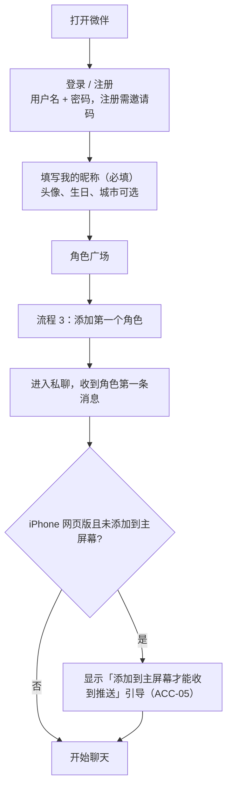

# 微伴关键用户流程

| 项 | 内容 |
|---|---|
| 负责人 | product-lead |
| 版本 | v1.3（随 PRD v1.3：新增流程 9 人设广场、流程 10 经期日记、流程 11 共同领养宠物；流程 1 补登录页口号；流程 2 全局换模型轻提示；流程 4c 成人模式需先选成人模式模型）。v1.2（随 PRD v1.2：流程 1 去掉配置模型；流程 2 改为「服务页：余额与模型」；流程 4c 成人模式与聊天信息页；流程 7a 删除通话费用提示、补余额不足；流程 8 自定义角色分类选择）。v1.1：注册需邀请码、导入格式与截图导入 |
| 日期 | 2026-10-05 |
| 说明 | 描述用户「一步步做什么、看到什么」。规则细节以 `docs/product/prd-v1.md` 各章为准，本文只引用需求编号；参数（P-xx）见 PRD 第 5 节。界面长什么样由设计负责人决定。 |

## 目录

1. 首次使用
2. 服务页：余额与模型
3. 添加角色（含名片推荐、群里添加）
4. 私聊
5. 群聊（含角色主动拉群）
6. 朋友圈
7. 来电与通话
8. 导入聊天记录生成角色
9. 人设广场（v1.3）
10. 经期日记（v1.3）
11. 共同领养宠物（v1.3）

---

## 流程 1：首次使用（ACC-04）

**分支与异常**：
- 余额为零：可以添加角色，收到的是备用开场白；私聊顶部横条「余额不足，角色暂时无法回复」+「查看余额」（MDL-10、CHR-03）。
- iOS 低于 16.4：提示收不到推送（ACC-05）。
- 登录 / 引导页口号：「把爱豆加进你的好友列表」（ACC-04，v1.3）。
- 不需要配置模型：平台已设好默认模型（MDL-02）。新账号的余额来自邀请码预设的赠送余额或管理员手动加（ADM-01 第 6 条、ADM-07）。

**验收要点**：从登录到发出第一条消息不超过 4 个页面跳转（ACC-04）。

---

## 流程 2：服务页：余额与模型（SVC-01、MDL-02～MDL-10）

1. 入口：「我 → 服务」。顶部卡片左边是余额，右边是当前聊天模型；下方是分组宫格（SVC-01 第 2 条）。
2. **看余额**：点余额 → 余额页：大字余额 →「余额明细」（默认按天 + 角色 + 类型合并，点开看每次调用）/「花费统计与后台预算」/「价目表」。没有充值按钮，显示「如需增加余额，请联系管理员」（MDL-07～MDL-09）。
3. **换模型**：点模型 → 模型页：聊天模型 / 后台模型 / 成人模式模型（可选）。每个模型显示价格档位和「大约每条回复 X 元」→ 选中即生效（MDL-02）。
4. **从排行榜选**：模型页顶部「看排行榜」（或服务页宫格）→ 可按「中文角色扮演 / 性价比 / 允许成人内容」筛选 →「用这个模型」→ 直接设为聊天模型，显示轻提示「没有单独设置模型的角色，说话风格可能有变化」，不弹确认框（MDL-03、MDL-06 第 2 条）。
5. **设后台预算**：服务页「后台预算」宫格 → 输入每天最多花费（MDL-05）。

**之后可能发生**：
- 余额低于 P-32：「我」标签和「服务」入口出现红点，收到一次「余额不足」系统通知（MDL-10 第 1 条）。
- 余额低于 P-33：推演、朋友圈、主动消息先停，聊天照常（MDL-10 第 3 条）。
- 余额为零：会话顶部「余额不足」横条，消息照常送达；管理员加余额后角色补一次合并回复（MDL-10、ADM-07）。
- 模型服务故障：会话顶部系统横条，恢复后补一次合并回复，失败调用不扣费（MDL-04）。
- 为某个角色单独换模型：私聊右上角「…」→ 聊天信息 → 使用的模型 → 确认「说话风格可能变化」（MDL-06）。

### 2b 管理员加余额（ADM-07）

1. 管理后台 → 搜索用户名 → 输入金额 → 填写备注（必填）→ 二次确认。
2. 用户端余额 5 秒内更新，余额明细出现「管理员加余额」记录和备注。
3. 加错时用「扣减」新增一条更正记录，不能改删已有记录。

---

## 流程 3：添加角色（CHR-01～CHR-05、SOC-06）

### 3a 从角色广场添加

1. 通讯录右上角「添加角色」→ 角色广场（分类：明星 / 虚构角色 / 历史人物；可搜名字、别名、作品）。
2. 点角色卡片 → 资料页（简介、作品、生日、粉丝名；真人角色底部「根据公开资料创作」）。
3. 点「添加」→ 可填「打招呼的话」→ 发送申请。
4. P-30 时间内：「XX 通过了你的好友申请」→ 会话列表出现该角色 → 收到第一条消息（回应打招呼的话，问「我该怎么称呼你」）。
5. 用户回复称呼 → 角色确认并写入「TA 怎么叫我」（GRW-01）。
6. 首次进入私聊，顶部提示「想和 TA 是什么关系？」（可关闭，默认：明星为粉丝与偶像，其他为朋友）（GRW-02）。

### 3b 通过名片推荐添加（CHR-04）

1. 私聊中角色 A 发来角色 B 的名片（因为用户问起 B，或 A 和 B 有共同日常）。
2. 点名片 → B 的资料页 → 「添加」→ 同 3a 第 4 步，B 的第一条消息提到 A（「听 A 说你…」）。
3. 或点「不感兴趣」→ B 在冷却期内不再被推荐（P-27）。

### 3c 在角色拉的群里添加（SOC-06）

1. 角色拉的群中有用户没添加的角色 C → 点 C 的头像 → 资料页 →「添加」→ 同 3a 第 4 步。

**异常**：
- 通讯录达到上限 P-26：提示先删除一些角色。
- 删除后 30 天内重新添加：询问「恢复以前的记录和记忆」还是「重新认识」（CHR-06）。

---

## 流程 4：私聊（CHAT、MEM、SIM、SAFE-06）

### 4a 用户发起

1. 会话列表 → 点角色进入私聊。
2. **若满足 P-18**：顶部出现「你不在的这 X 天，TA……」摘要卡（条数上限见 P-18）→ 可点「问问 TA」预填输入框，或收起（SIM-11）。
3. 用户发消息（文字 / 表情 / 图片 / 语音 / 链接）→ 消息状态：发送中 → 已送达。
4. 角色侧（按会话设置）：
   - 已读 →（可能：已读不回 P-11，仅傲娇等人设）→ 正在输入 → 回复（关闭秒回时按 P-01 延迟；开启拆条时分 P-02 条）。
   - 偶尔：撤回重发、打错字更正（P-12、P-13）。
5. 用户连续发多条：角色等用户停下后统一回复（CHAT-04）。
6. 用户离开会话后角色才回复：推送通知 → 点击回到私聊（CHAT-10）。

### 4b 角色主动发起

1. 系统根据日常事件 / 约定 / 节日纪念日 / 久未联系 / 公开动态产生「理由」（SIM-05）。
2. 检查：主动消息开关、免打扰、活跃时段、上限 P-03 和 P-04、用户是否正在和别人聊（P-09）、是否还没回上一条主动消息。
3. 通过 → 角色发出（可能拆条，可能附图片或链接）→ 推送。
4. 用户回复 → 正常私聊；回复主动消息获得熟悉度（P-25）。

### 4c 特殊情境

- **用户表达自伤倾向**：角色以本人口吻关心，建议联系信任的人和 12356；暂停所有人设小巧思和冷淡表现；次日可能跟进一条关心（SAFE-06）。
- **模型不可用 / 余额不足**：用户消息照常送达；顶部系统横条；恢复后补一次合并回复（MDL-04、MDL-10）。
- **聊天信息页**：私聊右上角「…」→ 聊天信息：查找聊天记录、免打扰、置顶；「和 TA 的相处」一组（情景模式、贴合度、回复节奏、主动消息、称呼、关系、TA 的日常）；「高级」一组（使用的模型、我的补充设定）；点顶部「+」可从这个私聊拉群（CHAT-13）。
- **切换情景模式**：聊天信息 → 情景模式 → 选择 → 系统提示「已切换到 XX 模式」→ 下一条回复生效（MODE-02）。成人模式只对有资格的角色显示（不是真人、不是儿童）；已在「服务 → 模型」设置成人模式模型时选择即开启，没设置时提示先去选择、不开启（MODE-03、SAFE-03，v1.3）。成人模式中的内容不会被其他角色知道，推送不显示内容，不能做分享图（MODE-05）。所有角色当前模式的总览在「我 → 服务 → 情景模式」。
- **调人设贴合度**：聊天信息 → 滑杆 5 档（CHAT-09）；全局默认值在「我 → 服务 → 聊天偏好」。
- **收藏 / 分享图**：长按消息 → 收藏；多选 → 生成分享图 → 选模板 → 保存或分享（CHAT-11、EXP-01）。

---

## 流程 5：群聊（SOC-03～SOC-06）

### 5a 用户建群

1. 会话列表右上角「+」→「发起群聊」→ 从通讯录勾选 2 个到 P-21 上限个角色→ 完成；或在私聊的聊天信息页点「+」拉群（CHAT-13）。
   - 群聊的情景模式在群聊的聊天信息页，只显示全体成员都有资格的模式（SOC-03 第 4 条）。
2. 群名默认为成员名拼接，可改。
3. 用户发言 → 被 @ 的角色必回；其他角色按话痨度、话题相关度、关系亲疏决定是否回应，最多 P-19 个 → 角色之间可能互相接话 → 无用户新发言时最多连续 P-19 条后安静。
4. 没有关系的角色彼此表现为「不认识」，可以互相介绍，不编造共同经历（SOC-01）。

### 5b 用户不在时（SOC-05）

1. 「角色自己聊天」开关开启、且用户 7 天内在该群发过言 → 每天最多一次，角色基于日常事件发起话题（P-20）。
2. 不推送（除非 @ 用户）；会话列表显示未读数。
3. 用户回来翻看 → 可以加入话题。

### 5c 角色主动拉群（SOC-06）

1. 触发：推演出共同计划 / 用户在私聊中表示想认识 A 的朋友 / 节日；且满足 P-22、拉群者熟悉度 ≥ L3、成员都与拉群者有关系、未添加的成员最多 1 个。
2. 会话列表出现新群：「A 邀请你和 B、C 加入了群聊」→ A 说明拉群原因。
3. 用户参与聊天；可点未添加成员的头像添加（流程 3c）；可随时退出（A 在私聊中最多提一次，不挽留）。
4. 用户可在设置中关闭「允许角色拉我进群」。

---

## 流程 6：朋友圈（SOC-07～SOC-09）

### 6a 看角色的朋友圈

1. 底部「发现」→「朋友圈」（有新动态时入口显示角色头像小红点）。
2. 浏览：只显示通讯录中的角色和自己的动态；只看得到通讯录中角色的点赞评论。
3. 点赞 / 评论 → 该角色在 P-29 时限内回复评论（会推送）→ 有关系的其他角色可能接话。
4. 长按或「…」→ 收藏 / 生成分享图。

### 6b 用户发朋友圈

1. 朋友圈右上角相机 → 文字 + 最多 9 张图 → 选择「谁可以看」→ 发表。
2. P-29 时限内，可见角色按熟悉度和人设点赞、评论（评论图片需识图能力）→ 角色之间可在下面接话。
3. 不可见的角色不点赞、不评论、不在私聊提起。

### 6c 从角色资料页看

角色资料页 → 「朋友圈」只看该角色；「TA 的近况」看时间线（日常事件、朋友圈、和其他角色的互动、带「公开资料」标注的公开动态）（SIM-11）。

---

## 流程 7：来电与通话（MED-06、MED-07）

### 7a 用户给角色打电话

1. 私聊「+」→ 语音通话，或资料页「语音通话」。
   - 平台未开通语音服务：不显示通话入口（MED-06 第 11 条）。
   - 余额不足：不拨出，系统提示「余额不足，暂时无法通话」（MDL-10 第 5 条）。
   - 拨打前和通话中都**没有**任何费用提示（v1.2，MED-06 第 10 条已删除）。
2. 响铃 2–5 秒 → 角色接听并先开口 → 实时对话，可打断。
3. 接近单次通话时长上限时角色自然提醒（P-31）；通话中余额用完时角色在 30 秒内自然道别并挂断，私聊显示「余额不足，通话已结束」（MDL-10 第 5 条）。
4. 挂断 → 私聊出现「通话时长 mm:ss」→ 通话摘要进入记忆页。
5. iPhone 网页版若不支持：入口显示「iPhone 网页版暂不支持语音通话」。

### 7b 角色打来电话（默认关闭）

1. 开启方式：熟悉度达到 L3 时，角色在私聊中问「以后可以给你打电话吗？」→ 用户点「可以」（或在设置中手动开启）。
2. 触发：纪念日 / 约定结果 / 想分享的事；满足 P-10、活跃时段、非免打扰、用户没有正在聊天（P-09）。
3. 安卓原生客户端：全屏来电（锁屏也能弹出）→ 接听（同 7a 第 2 步起）/ 拒接 / 30 秒未接。
4. 拒接或未接：私聊显示「未接来电」→ 角色发一条消息（不施压）→ 当天不再打。
5. iPhone：推送「XX 想和你通话」→ 能通话则用户回拨，否则私聊显示「XX 给你打过电话」并附一条消息。

---

## 流程 8：导入聊天记录生成角色（CHR-07～CHR-09）

### 8a 生成新角色

1. 通讯录「添加角色」→「创建自己的角色」→「导入聊天记录」。
2. 阅读说明：支持粘贴文字、上传 .txt / .csv、上传聊天截图（张数有上限）；微信聊天记录请先用第三方工具导出成文本；提示「只导入你有权使用的内容」；显示预计花费（从余额扣，余额不足时不能开始）。
3. 粘贴 / 上传 → 系统识别发言人（截图导入时先显示识别出的对话请用户确认）→ 用户选择「哪一方是要生成的角色」。
4. 选择是否「保留原文以便以后补充」（默认不保留）。
5. 等待生成（可离开页面，完成后通知）。
6. 进入角色编辑器，查看草稿：名字、说话方式、口头禅、常用表情、性格、示例对话、重要经历。
   - 角色分类默认为「真人」；勾选「不以真实人物本人身份出现（新名字、无真实作品 / 关系 / 经历），或这是虚构对话」声明后可改为原创或虚构，草稿中识别出的真名会提示替换（CHR-08）。
   - 填写年龄设定等必填项。
7. 「试聊」几句 → 满意后保存 → 角色进入通讯录，开始「认识第 1 天」。

### 8b 补充已有角色

1. 私聊右上角「…」→ 聊天信息 →「我的补充设定」→ 导入或手写。
2. 预设角色：生成补充设定，只对自己生效；与公开事实冲突的条目被提示并以公开事实为准。
3. 自定义角色：合并进人设，确认后生效。
4. 可随时查看、编辑、删除补充设定。

### 8c 手动创建

1. 「创建自己的角色」→「手动填写」→ 填必填项（名字、角色分类、年龄设定、人设描述）→ 可选项 → 试聊 → 保存。
   - 角色分类由用户自选：原创 / 虚构作品中的角色 / 真人，每项有判断说明。以某明星为灵感、用新名字、不写 TA 真实作品和经历的，选「原创」（CHR-07 第 3 条、SAFE 10.0）。
2. 保存后「真人」不可改为其他分类，「未满 18 岁」不可改为「已满 18 岁」（CHR-07）。

**异常**：识别不出发言人 → 显示格式说明；文本过长 → 提示只取最近部分或分批导入；截图导入但所选模型不支持识图 → 提示更换模型（CHR-08）。

---

## 流程 9：人设广场（PLZ-01～PLZ-07，v1.3）

### 9a 发布

1. 自定义角色：私聊右上角「…」→ 聊天信息 →「发布到人设广场」。预设改版：聊天信息 → 我的补充设定 →「发布为改版」。
2. 第一次发布：设置广场昵称（默认我的昵称），看到「其他用户会看到你的广场昵称和头像」（PLZ-02 第 2 条）。
3. 填一句话介绍、发布说明；选「允许改编后再发布」「开放评论」（默认都开）。
4. 「发布内容确认」页：逐项列出将要发布的文字；疑似私人信息（手机号、地址、我的昵称、专属称呼等）被标出并默认遮盖 → 逐条改写或确认保留（PLZ-02 第 6 条）。
   - 真人分类：上传过的头像不发布，显示默认头像（PLZ-02 第 5 条）。
   - 系统重跑儿童特征检测（PLZ-02 第 7 条）。
5. 发布 → 作品出现在「发现 → 角色广场 → 人设广场」。

### 9b 浏览与使用

1. 「发现 → 角色广场」→ 顶部切到「人设广场」→ 热门 / 最新 / 点赞最多；可搜名字、标签、作者、基于的预设角色。
2. 点卡片 → 作品页：介绍、完整内容预览、版本记录、评论区。
3. 点赞 / 评论（P-35 字以内，可回复他人评论）。
4. 「添加为我的角色」→ 走添加流程（流程 3a 第 4 步起）→ 新角色进通讯录，分类与来源相同且锁定（PLZ-04 第 1、2 条）。
5. 预设改版还可以「应用到我的 XX」→ 替换我对该角色的补充设定，聊天记录、记忆、熟悉度不变（PLZ-04 第 3 条）；没加过该角色时为「添加 XX 并应用」。

### 9c 之后可能发生

- 作者发布新版本 → 我那个角色的资料页出现「作者发布了新版本」→ 我选「更新」或「暂不更新」，不会被自动改（PLZ-05）。
- 作者或管理员下架作品 → 广场上看不到了，我复制的角色照常可用（PLZ-06、ADM-09）。
- 看到不合适的作品或评论 →「…」→ 举报 → 管理员处理后收到结果通知（PLZ-07）。
- 自己作品收到点赞、评论 → 人设广场「我发布的」出现红点，没有推送（PLZ-03 第 4 条）。

---

## 流程 10：经期日记（PLAY-01，v1.3）

1. 「我 → 服务 → 经期日记」→ 第一次进入看到说明（加密、只给授权角色、不进朋友圈 / 群聊 / 分享图 / 广场、预测仅供参考）。
2. 记录开始日 → 可选记录流量、痛感、症状、备注（备注只给自己看）→ 日历显示已记录和预测（P-37）。
3. 「让谁知道」→ 勾选角色（默认一个都没有）→ 确认。
4. 之后：
   - 预计开始前 P-37 天：熟悉度最高的那个授权角色发一条提醒（每周期合计 ≤ P-36，在活跃时段内、免打扰之外）；
   - 记录痛感「中 / 重」当天：一个授权角色发一条关心；
   - 私聊中授权角色每天最多主动提起 1 次；我自己说不舒服时正常关心；
   - 这些消息带「健康」标记：推送不显示内容、不能做分享图。
5. 取消某个角色的授权 → 该角色立即不再知道；删除记录、清空日记随时可做。

---

## 流程 11：共同领养宠物（PLAY-02，v1.3）

1. 发起：私聊「…」→ 聊天信息 →「我们的宠物」→「和 TA 一起领养」；或熟悉度 L2 以上的角色在聊天中提议一次。
2. 选物种 → 选外观 → 起名（自己填，或「让 TA 起名」：角色在私聊给 3 个候选）→ 完成。
3. 私聊出现「你和 XX 一起领养了团子」→ 角色回应 → 卡册多一张「我们的团子」瞬间卡、成就「一起养了只小家伙」。
4. 之后：
   - 宠物页点喂食 / 玩耍 / 摸摸（免费，每天计亲密值 ≤ P-39）；
   - 角色在日常里照顾宠物，偶尔发来宠物照片，朋友圈可能晒宠物（可在宠物页关闭）；
   - 第 30、100 天进入新的成长阶段 → 瞬间卡；第一次长到成年 → 成就「长大啦」；
   - 很久不来也没关系：宠物照常长大，不会生病或离开，角色也不会拿宠物催你。
5. 结束：宠物页「送养」→ 二次确认 → 宠物进入「回忆」，角色反应一次、不挽留。
