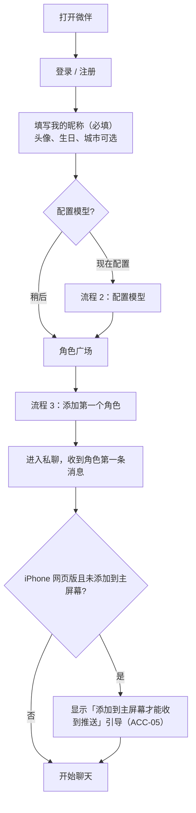

# 微伴关键用户流程

| 项 | 内容 |
|---|---|
| 负责人 | product-lead |
| 版本 | v1.0（随 PRD v1.0） |
| 日期 | 2026-10-04 |
| 说明 | 描述用户「一步步做什么、看到什么」。规则细节以 `docs/product/prd-v1.md` 各章为准，本文只引用需求编号；参数（P-xx）见 PRD 第 5 节。界面长什么样由设计负责人决定。 |

## 目录

1. 首次使用
2. 配置模型（BYOK）
3. 添加角色（含名片推荐、群里添加）
4. 私聊
5. 群聊（含角色主动拉群）
6. 朋友圈
7. 来电与通话
8. 导入聊天记录生成角色

---

## 流程 1：首次使用（ACC-04）

**分支与异常**：
- 跳过模型配置：可以添加角色，收到的是备用开场白；私聊顶部横条「还没有配置模型」+「去配置」（ACC-04、CHR-03）。
- iOS 低于 16.4：提示收不到推送（ACC-05）。

**验收要点**：从登录到发出第一条消息不超过 5 个页面跳转（ACC-04）。

---

## 流程 2：配置模型（MDL-01～MDL-04）

1. 入口：首次引导，或「我 → 设置 → 模型与密钥」。
2. 页面顶部有「不知道选哪个？看排行榜」（MDL-03）。
3. **从排行榜进入**：浏览榜单 → 可按「中文角色扮演 / 性价比 / 允许成人内容」筛选 → 点某个模型「用这个模型」：
   - 已有该供应商密钥 → 直接设为聊天模型 → 完成；
   - 没有 → 跳到第 4 步，供应商已预选。
4. **填写密钥**：选供应商 → 看「去哪里申请」说明 → 粘贴密钥 → 系统自动连通测试：
   - 成功 → 显示「可用」和可用模型列表 → 保存（之后只显示前 4 后 4 位）；
   - 失败 → 显示原因（密钥错误 / 余额不足 / 网络不通 / 供应商故障）→ 不保存，可重试。
5. **选模型**：聊天模型（必选）→ 后台模型（可选，建议便宜的）→ 成人模式模型（可选，只在需要时设置）。
6. 完成后回到来源页面。

**之后可能发生**：
- 密钥失效 / 额度用完：相关会话顶部出现系统横条 →「去处理」回到第 4 步 → 修复后角色补一次合并回复（MDL-04）。
- 为某个角色单独换模型：角色资料页 → 聊天设置 → 使用的模型 → 确认「说话风格可能变化」（MDL-06）。
- 查看花费：「模型与密钥 → 用量」，可设后台预算（MDL-05）。

---

## 流程 3：添加角色（CHR-01～CHR-05、SOC-06）

### 3a 从角色广场添加

1. 通讯录右上角「添加角色」→ 角色广场（分类：明星 / 虚构角色 / 历史人物；可搜名字、别名、作品）。
2. 点角色卡片 → 资料页（简介、作品、生日、粉丝名；真人角色底部「根据公开资料创作」）。
3. 点「添加」→ 可填「打招呼的话」→ 发送申请。
4. P-30 时间内：「XX 通过了你的好友申请」→ 会话列表出现该角色 → 收到第一条消息（回应打招呼的话，问「我该怎么称呼你」）。
5. 用户回复称呼 → 角色确认并写入「TA 怎么叫我」（GRW-01）。
6. 首次进入私聊，顶部提示「想和 TA 是什么关系？」（可关闭，默认：明星为粉丝与偶像，其他为朋友）（GRW-02）。

### 3b 通过名片推荐添加（CHR-04）

1. 私聊中角色 A 发来角色 B 的名片（因为用户问起 B，或 A 和 B 有共同日常）。
2. 点名片 → B 的资料页 → 「添加」→ 同 3a 第 4 步，B 的第一条消息提到 A（「听 A 说你…」）。
3. 或点「不感兴趣」→ B 在冷却期内不再被推荐（P-27）。

### 3c 在角色拉的群里添加（SOC-06）

1. 角色拉的群中有用户没添加的角色 C → 点 C 的头像 → 资料页 →「添加」→ 同 3a 第 4 步。

**异常**：
- 通讯录达到上限 P-26：提示先删除一些角色。
- 删除后 30 天内重新添加：询问「恢复以前的记录和记忆」还是「重新认识」（CHR-06）。

---

## 流程 4：私聊（CHAT、MEM、SIM、SAFE-06）

### 4a 用户发起

1. 会话列表 → 点角色进入私聊。
2. **若满足 P-18**：顶部出现「你不在的这 X 天，TA……」摘要卡（条数上限见 P-18）→ 可点「问问 TA」预填输入框，或收起（SIM-11）。
3. 用户发消息（文字 / 表情 / 图片 / 语音 / 链接）→ 消息状态：发送中 → 已送达。
4. 角色侧（按会话设置）：
   - 已读 →（可能：已读不回 P-11，仅傲娇等人设）→ 正在输入 → 回复（关闭秒回时按 P-01 延迟；开启拆条时分 P-02 条）。
   - 偶尔：撤回重发、打错字更正（P-12、P-13）。
5. 用户连续发多条：角色等用户停下后统一回复（CHAT-04）。
6. 用户离开会话后角色才回复：推送通知 → 点击回到私聊（CHAT-10）。

### 4b 角色主动发起

1. 系统根据日常事件 / 约定 / 节日纪念日 / 久未联系 / 公开动态产生「理由」（SIM-05）。
2. 检查：主动消息开关、免打扰、活跃时段、上限 P-03 和 P-04、用户是否正在和别人聊（P-09）、是否还没回上一条主动消息。
3. 通过 → 角色发出（可能拆条，可能附图片或链接）→ 推送。
4. 用户回复 → 正常私聊；回复主动消息获得熟悉度（P-25）。

### 4c 特殊情境

- **用户表达自伤倾向**：角色以本人口吻关心，建议联系信任的人和 12356；暂停所有人设小巧思和冷淡表现；次日可能跟进一条关心（SAFE-06）。
- **模型不可用**：用户消息照常送达；顶部系统横条；修复后补一次合并回复（MDL-04）。
- **切换情景模式**：私聊设置 → 情景模式 → 选择 → 系统提示「已切换到 XX 模式」→ 下一条回复生效（MODE-02）。成人模式需年龄确认和成人模式模型，且只对有资格的角色显示（MODE-03、SAFE-03）。
- **调人设贴合度**：私聊设置 → 滑杆 5 档（CHAT-09）。
- **收藏 / 分享图**：长按消息 → 收藏；多选 → 生成分享图 → 选模板 → 保存或分享（CHAT-11、EXP-01）。

---

## 流程 5：群聊（SOC-03～SOC-06）

### 5a 用户建群

1. 会话列表右上角「发起群聊」→ 从通讯录勾选 2 个到 P-21 上限个角色→ 完成。
2. 群名默认为成员名拼接，可改。
3. 用户发言 → 被 @ 的角色必回；其他角色按话痨度、话题相关度、关系亲疏决定是否回应，最多 P-19 个 → 角色之间可能互相接话 → 无用户新发言时最多连续 P-19 条后安静。
4. 没有关系的角色彼此表现为「不认识」，可以互相介绍，不编造共同经历（SOC-01）。

### 5b 用户不在时（SOC-05）

1. 「角色自己聊天」开关开启、且用户 7 天内在该群发过言 → 每天最多一次，角色基于日常事件发起话题（P-20）。
2. 不推送（除非 @ 用户）；会话列表显示未读数。
3. 用户回来翻看 → 可以加入话题。

### 5c 角色主动拉群（SOC-06）

1. 触发：推演出共同计划 / 用户在私聊中表示想认识 A 的朋友 / 节日；且满足 P-22、拉群者熟悉度 ≥ L3、成员都与拉群者有关系、未添加的成员最多 1 个。
2. 会话列表出现新群：「A 邀请你和 B、C 加入了群聊」→ A 说明拉群原因。
3. 用户参与聊天；可点未添加成员的头像添加（流程 3c）；可随时退出（A 在私聊中最多提一次，不挽留）。
4. 用户可在设置中关闭「允许角色拉我进群」。

---

## 流程 6：朋友圈（SOC-07～SOC-09）

### 6a 看角色的朋友圈

1. 底部「发现」→「朋友圈」（有新动态时入口显示角色头像小红点）。
2. 浏览：只显示通讯录中的角色和自己的动态；只看得到通讯录中角色的点赞评论。
3. 点赞 / 评论 → 该角色在 P-29 时限内回复评论（会推送）→ 有关系的其他角色可能接话。
4. 长按或「…」→ 收藏 / 生成分享图。

### 6b 用户发朋友圈

1. 朋友圈右上角相机 → 文字 + 最多 9 张图 → 选择「谁可以看」→ 发表。
2. P-29 时限内，可见角色按熟悉度和人设点赞、评论（评论图片需识图能力）→ 角色之间可在下面接话。
3. 不可见的角色不点赞、不评论、不在私聊提起。

### 6c 从角色资料页看

角色资料页 → 「朋友圈」只看该角色；「TA 的近况」看时间线（日常事件、朋友圈、和其他角色的互动、带「公开资料」标注的公开动态）（SIM-11）。

---

## 流程 7：来电与通话（MED-06、MED-07）

### 7a 用户给角色打电话

1. 私聊「+」→ 语音通话，或资料页「语音通话」。
2. 响铃 2–5 秒 → 角色接听并先开口 → 实时对话，可打断。
3. 接近单次通话时长上限时角色自然提醒（上限见 MED-06）。
4. 挂断 → 私聊出现「通话时长 mm:ss」→ 通话摘要进入记忆页。
5. iPhone 网页版若不支持：入口显示「iPhone 网页版暂不支持语音通话」。

### 7b 角色打来电话（默认关闭）

1. 开启方式：熟悉度达到 L3 时，角色在私聊中问「以后可以给你打电话吗？」→ 用户点「可以」（或在设置中手动开启）。
2. 触发：纪念日 / 约定结果 / 想分享的事；满足 P-10、活跃时段、非免打扰、用户没有正在聊天（P-09）。
3. 安卓：全屏来电 → 接听（同 7a 第 2 步起）/ 拒接 / 30 秒未接。
4. 拒接或未接：私聊显示「未接来电」→ 角色发一条消息（不施压）→ 当天不再打。
5. iPhone：推送「XX 想和你通话」→ 能通话则用户回拨，否则私聊显示「XX 给你打过电话」并附一条消息。

---

## 流程 8：导入聊天记录生成角色（CHR-07～CHR-09）

### 8a 生成新角色

1. 通讯录「添加角色」→「创建自己的角色」→「导入聊天记录」。
2. 阅读说明：支持粘贴文字或上传 .txt；提示「只导入你有权使用的内容」；显示预计花费档位。
3. 粘贴 / 上传 → 系统识别发言人 → 用户选择「哪一方是要生成的角色」。
4. 选择是否「保留原文以便以后补充」（默认不保留）。
5. 等待生成（可离开页面，完成后通知）。
6. 进入角色编辑器，查看草稿：名字、说话方式、口头禅、常用表情、性格、示例对话、重要经历。
   - 角色类型默认锁定「基于真实存在的人」；只有勾选「这是虚构对话」声明后才能改（CHR-08）。
   - 填写年龄设定等必填项。
7. 「试聊」几句 → 满意后保存 → 角色进入通讯录，开始「认识第 1 天」。

### 8b 补充已有角色

1. 角色资料页 → 聊天设置 →「我的补充设定」→ 导入或手写。
2. 预设角色：生成补充设定，只对自己生效；与公开事实冲突的条目被提示并以公开事实为准。
3. 自定义角色：合并进人设，确认后生效。
4. 可随时查看、编辑、删除补充设定。

### 8c 手动创建

1. 「创建自己的角色」→「手动填写」→ 填必填项（名字、角色类型、年龄设定、人设描述）→ 可选项 → 试聊 → 保存。
2. 保存后「基于真实存在的人」不可改为其他类型，「未满 18 岁」不可改为「已满 18 岁」（CHR-07）。

**异常**：识别不出发言人 → 显示格式说明；文本过长 → 提示只取最近部分或分批导入（CHR-08）。
